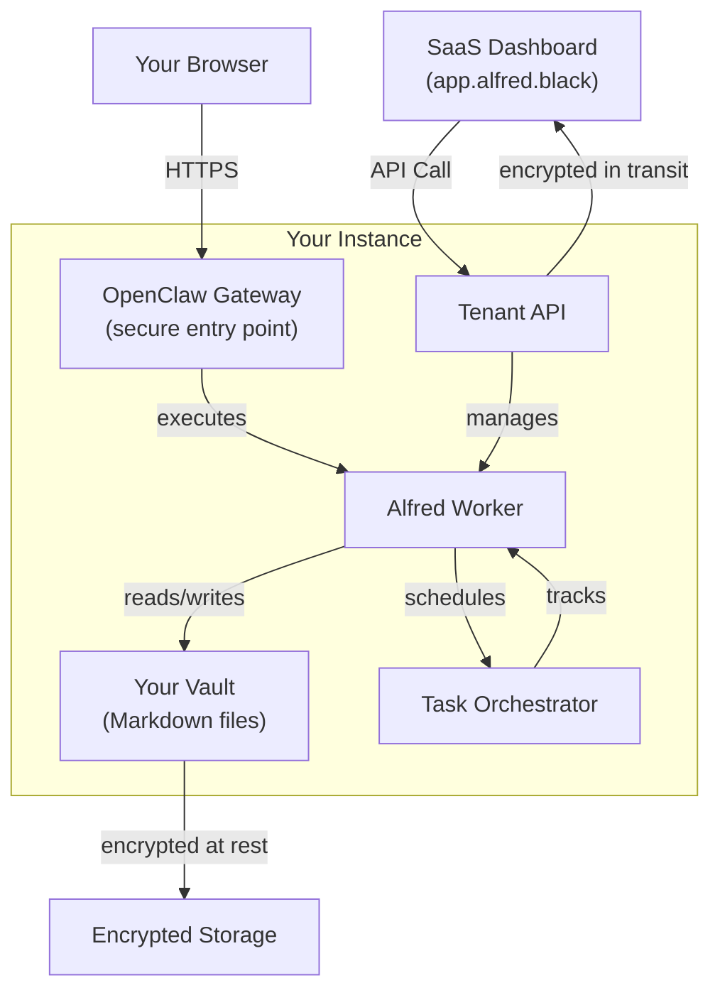
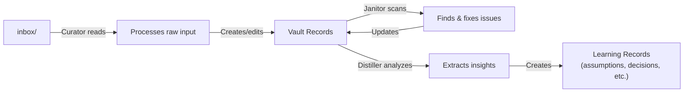

## System Overview

Alfred runs as a private instance in the cloud, containing several specialized components that work together to manage your vault:



**Key principle**: All your data stays on your instance. The SaaS dashboard communicates with your instance via secure API calls, but never stores vault content.

## How Requests Flow

When you interact with Alfred, here's what happens:

1. **Dashboard Request**: You click an action in the SaaS dashboard (e.g., "Organize inbox")
2. **API Call**: Dashboard sends a request to your instance's Tenant API
3. **Worker Execution**: API invokes the Alfred Worker, which runs the appropriate tool
4. **Vault Access**: Worker reads and writes records in your vault
5. **Response**: Results return to the dashboard

All communication is encrypted end-to-end. Your API key (stored securely in your browser's local storage) authenticates each request.

## Component Stack

### OpenClaw Gateway

Your secure entry point. Manages:
- Device pairing (linking your devices to your instance)
- Agent sessions (maintaining context for AI operations)
- Skill execution (running specialized prompts on your vault)

Think of it as the "front door" to your instance.

### Tenant API

A lightweight API server that:
- Authenticates requests from the SaaS dashboard
- Routes commands to the Alfred Worker
- Returns results and status updates

Runs as a simple Node.js process with no external dependencies.

### Alfred Worker

The brain of your instance. Runs four specialized tools that process your vault:
- **Curator**: Organizes raw inputs from your inbox into structured records
- **Janitor**: Scans for broken links, missing fields, and orphaned notes
- **Distiller**: Extracts insights (decisions, assumptions, constraints) from your records
- **Surveyor** (optional): Clusters similar notes and suggests connections

### Task Orchestrator

Temporal workflow engine that schedules and tracks background tasks. Ensures work completes reliably, even if your instance restarts.

## Worker Pipeline

Your vault is processed through a simple, repeatable flow:



### Curator

Watches your inbox for new files. When it finds one:
1. Reads the raw content
2. Uses AI to extract structure (title, type, relationships)
3. Creates a new record in the appropriate vault directory
4. Marks the inbox file as processed

### Janitor

Runs periodically (by default, once daily) to:
- Find broken wikilinks (references to non-existent notes)
- Detect invalid frontmatter
- Identify orphaned records (notes with no relationships)
- Fix common issues automatically

Think of it as a spell-checker for your vault.

### Distiller

Analyzes your operational records to extract hidden knowledge:
- **Assumptions**: "We assume users want fast results"
- **Decisions**: "We chose SQLite for simplicity"
- **Constraints**: "Limited to 10GB vault size"
- **Contradictions**: "Plan says X, records show Y"

Deduplicates automatically—won't create learning records you already have.

## Data Layout

Your vault is organized into entity types (person, org, project, task, etc.) and learning types (assumption, decision, constraint, etc.):

```
vault/
├── inbox/              # Where you drop raw inputs
├── person/             # People (contacts, team members)
├── org/                # Organizations
├── project/            # Projects and initiatives
├── task/               # Tasks and to-dos
├── decision/           # Learning: decisions made
├── assumption/         # Learning: assumptions held
├── constraint/         # Learning: constraints discovered
└── _templates/         # Template files for each type
```

**Important**: Your vault is the source of truth. All processing is non-destructive—tools create new records and fix issues, but your original notes are never deleted without your permission.

<Tip>
All data is encrypted at rest on your instance's storage. For details on security, see the [Security Profile](/concepts/security-model).
</Tip>

## Reliability & Recovery

Your instance is designed for reliability:

- **Automated health checks**: We periodically verify your instance is responding
- **Task persistence**: If your instance restarts, background tasks resume from where they left off
- **Encrypted backups**: Daily automatic backups ensure you can recover if something goes wrong
- **Mutation tracking**: Every change to your vault is logged in an append-only audit trail

If you need to reset a tool (e.g., re-process everything with Curator), the underlying state files can be cleared—the vault records themselves are never affected.

## Isolation & Multi-Tenancy

Each user's instance is completely isolated:
- Separate cloud infrastructure
- Separate encrypted storage volume
- Separate task queue and worker
- Separate gateway and API credentials

Your vault data never touches another user's instance, and the SaaS control plane never stores vault content.

---

**Want deeper details?** See [Security Profile](/concepts/security-model) for encryption, authentication, and network security. Or check out [Vault Schema](/reference/vault-schema) to understand the record types and structure.
