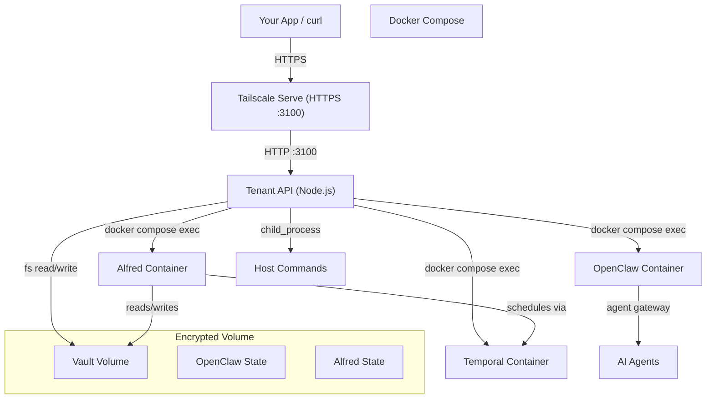
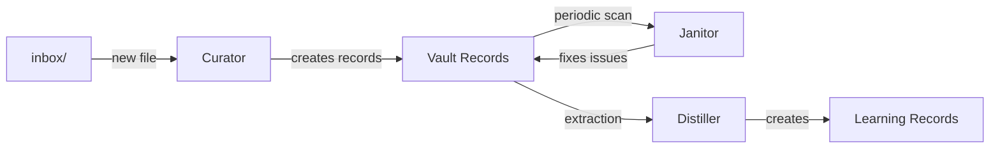

## System overview



## Network architecture

All services bind to `localhost` — nothing is exposed to the public internet. External access is exclusively through your Tailscale mesh network.

| Port | Service | Access |
|------|---------|--------|
| 3100 | Tenant API | Tailscale Serve (HTTPS) |
| 443 | OpenClaw Gateway | Tailscale Serve (HTTPS) |
| 8233 | Temporal UI | Tailscale Serve (HTTPS) |

<Note>
  The API key authenticates every request. Tailscale provides the encrypted transport and network-level access control. See [Security Model](/concepts/security-model) for details.
</Note>

## Component stack

### Tenant API

A standalone Node.js process (`/opt/alfred/api.mjs`) running as a systemd service. It uses `child_process.execFile` with array arguments (no shell interpretation) to communicate with Docker containers and host commands.

- **Auth**: Bearer token via `AAS_API_KEY` environment variable
- **Binding**: `127.0.0.1:3100` (reverse-proxied by Tailscale Serve)
- **Dependencies**: Zero — no npm packages, no native addons. Just Node.js 22 built-ins.

### Alfred container

Runs the four Alfred tools (Curator, Janitor, Distiller, Surveyor) as background daemons. Each tool:

1. Receives work (inbox file, scan trigger, extraction request)
2. Builds a prompt from bundled skill files + vault context
3. Invokes an AI agent backend (OpenClaw, Claude Code, or HTTP API)
4. The agent reads/writes vault files via `alfred vault` CLI commands
5. Changes are tracked in a JSONL mutation log

### OpenClaw container

The AI agent gateway. Manages device pairing, sessions, skills, and agent execution. Devices (laptops, phones, Claude Code instances) pair with the gateway to get agent access to the vault.

### Temporal container

Workflow orchestration using [Temporal](https://temporal.io). Runs a dev server with SQLite storage. Alfred tools can be triggered as Temporal workflows with cron schedules, retry policies, and signal handling.

## Data layout

All persistent data lives on a LUKS2-encrypted volume mounted at `/mnt/encrypted/`:

```
/mnt/encrypted/
├── vault/              # Obsidian vault (Markdown files)
│   ├── inbox/          # Raw input files (Curator picks these up)
│   ├── person/         # Person records
│   ├── project/        # Project records
│   ├── task/           # Task records
│   ├── meeting/        # Meeting records
│   ├── decision/       # Decision records
│   ├── ...             # 20 more type directories
│   ├── _templates/     # Per-type Markdown templates
│   └── _bases/         # Dataview base views
├── openclaw/           # OpenClaw state (openclaw.json, device DB)
├── alfred/             # Alfred state (curator_state.json, etc.)
└── temporal/           # Temporal SQLite database
```

## Worker pipeline



### Curator

Watches `inbox/` for new files. When one appears:
1. Reads the raw content
2. Loads the curator skill prompt (`SKILL.md`) + vault context
3. Invokes the AI agent, which creates/edits vault records
4. Marks the file as processed in `curator_state.json`

### Janitor

Periodically sweeps the vault:
1. Scans for broken wikilinks, invalid frontmatter, missing required fields, orphaned records
2. Reports issues
3. Optionally invokes the AI agent to fix them

### Distiller

Analyzes operational records and extracts knowledge:
1. Scans records for implicit assumptions, decisions, constraints
2. Checks for duplicates against existing learning records
3. Creates new learning records (assumption, decision, constraint, contradiction, synthesis)

## Backup strategy

- **Automated daily backups** at 3:00 AM via restic to Hetzner Object Storage
- Containers are stopped during backup for consistency
- **Retention**: 7 daily, 4 weekly, 6 monthly snapshots
- LUKS encryption key and restic credentials are backed up locally on the control plane
- On-demand backups via `POST /api/v1/admin/backups/trigger`
