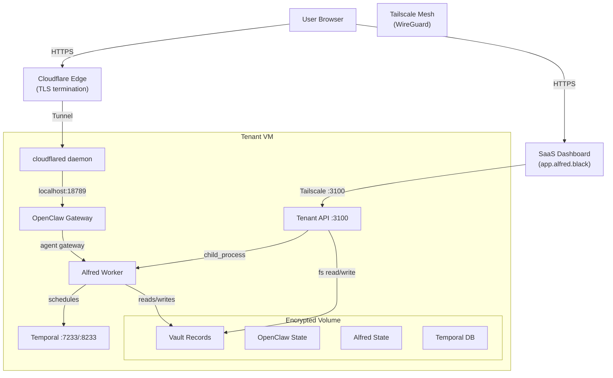
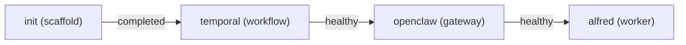
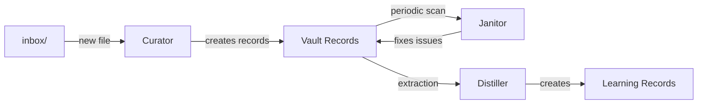

## System Overview



## Network Architecture

Alfred uses a **four-layer network model**. User-facing traffic flows through Cloudflare Tunnel. Admin and SaaS-to-tenant traffic flows through Tailscale. No application ports are exposed to the public internet.

| Port | Service | Binding | User Access | Admin Access |
|------|---------|---------|-------------|-------------|
| 18789 | OpenClaw Gateway | 127.0.0.1 | Cloudflare Tunnel | -- |
| 3100 | Tenant API | 127.0.0.1 | -- | Tailscale Serve (HTTPS) |
| 8233 | Temporal UI | 127.0.0.1 | -- | Tailscale Serve (HTTPS) |
| 7233 | Temporal gRPC | 127.0.0.1 | -- | Docker internal network |

```
Internet Users ──HTTPS──> Cloudflare Edge ──Tunnel──> cloudflared ──> localhost:18789 (OpenClaw)

SaaS Dashboard ──Tailscale──> alfred-{name}:3100 (Tenant API)

Admin ──Tailscale──> alfred-{name}:8233 (Temporal UI)
       ──SSH (22)──> deploy@{ip} (restricted to admin CIDRs)
```

<Note>
All services bind to `127.0.0.1`. The only way to reach them is through Cloudflare Tunnel (user-facing) or Tailscale (admin/SaaS). See [Security Profile](/concepts/security-model) for the full network security model.
</Note>

## Component Stack

### Tenant API

A standalone Node.js process (`/opt/alfred/api.mjs`) running as a systemd service. Zero npm dependencies -- just Node.js 22 built-ins.

- **Auth**: Bearer token via `alf_` API keys (timing-safe comparison)
- **Binding**: `127.0.0.1:3100` (exposed via Tailscale Serve)
- **Execution**: Uses `child_process.execFile` with array arguments (no shell interpretation)
- **Accessed by**: SaaS dashboard proxy over Tailscale

### OpenClaw Container

The AI agent gateway. Manages device pairing, sessions, skills, and agent execution.

- **Image**: `ssdavidai00/alfred-openclaw:latest`
- **Port**: `127.0.0.1:18789` (exposed via Cloudflare Tunnel at `{tenant}.alfred.black`)
- **Auth**: Gateway token (URL parameter)
- **Security**: `no-new-privileges`, `cap_drop: ALL`, `cap_add: DAC_OVERRIDE`, 2GB mem, 256 PIDs

### Alfred Container (Worker)

Runs the four Alfred tools (Curator, Janitor, Distiller, Surveyor) as background daemons:

1. Receives work (inbox file, scan trigger, extraction request)
2. Builds a prompt from bundled skill files + vault context
3. Invokes the AI agent backend (OpenClaw gateway via `ws://openclaw:18789`)
4. Agent reads/writes vault files via scoped `alfred vault` CLI commands
5. Changes tracked in append-only JSONL mutation log

- **Image**: `ssdavidai00/alfred-worker:latest`
- **Ports**: None (no network exposure)
- **Security**: `no-new-privileges`, `cap_drop: ALL`, 2GB mem, 256 PIDs

### Temporal Container

Workflow orchestration using [Temporal](https://temporal.io) in dev mode with SQLite storage.

- **Image**: `temporalio/temporal:latest`
- **Ports**: `127.0.0.1:7233` (gRPC), `127.0.0.1:8233` (UI, admin-only via Tailscale)
- **Storage**: SQLite at `/mnt/encrypted/temporal/temporal.db`
- **Security**: `no-new-privileges`, 2GB mem, 256 PIDs

### Cloudflared (Host Service)

Cloudflare Tunnel daemon running as a systemd service on the host. Establishes an outbound-only tunnel to Cloudflare's edge network.

- **Config**: `/etc/cloudflared/config.yml`
- **Credentials**: `/etc/cloudflared/credentials.json` (mode 0600)
- **Route**: `{tenant}.alfred.black` to `localhost:18789`
- **DNS**: CNAME record `{tenant}.alfred.black` pointing to `{tunnel-id}.cfargotunnel.com`

## Startup Sequence



The `init` container scaffolds the vault directory structure and OpenClaw configuration, then exits (exit code 0 = healthy). Temporal must respond on gRPC before OpenClaw starts. OpenClaw must respond on `/health` before Alfred starts.

## Data Layout

All persistent data lives on a LUKS2-encrypted volume mounted at `/mnt/encrypted/`:

```
/mnt/encrypted/
├── vault/              # Obsidian vault (Markdown files)
│   ├── inbox/          # Raw inputs (Curator picks these up)
│   ├── person/         # Entity type directories (20 total)
│   ├── decision/       # Learning types (5 total)
│   ├── _templates/     # Per-type Markdown templates
│   └── _bases/         # Dataview base views
├── openclaw/           # OpenClaw state (config, device pairing)
│   └── workspace/vault # Symlink for wikilink resolution
├── alfred/             # Worker state, config, audit log
│   └── .gateway-token  # OpenClaw gateway auth
└── temporal/           # Temporal SQLite database
```

<Tip>
The encrypted volume is the single source of truth. State files (`*_state.json`) are bookkeeping and can be deleted to force re-processing. The vault records themselves are authoritative.
</Tip>

## Worker Pipeline



### Curator

Watches `inbox/` for new files. Reads the raw content, loads the curator skill prompt + vault context, invokes the AI agent (which creates/edits records), and marks the file as processed.

### Janitor

Periodically sweeps the vault for broken wikilinks, invalid frontmatter, missing required fields, and orphaned records. Reports issues and optionally invokes the AI agent to fix them.

### Distiller

Analyzes operational records and extracts latent knowledge (assumptions, decisions, constraints, contradictions). Checks for duplicates against existing learning records before creating new ones.

## Provisioning Flow

When a new tenant is provisioned, alfred-ctrl orchestrates these steps:

<Steps>
<Step title="Generate SSH keypair">
Ed25519 keypair created per-instance and stored locally.
</Step>
<Step title="Create infrastructure">
Hetzner server with hardened firewall, LUKS2-encrypted volume attached.
</Step>
<Step title="Cloud-init bootstrap">
System setup: Docker, Tailscale (APT), cloudflared (APT), SSH hardening, UFW, fail2ban, unattended upgrades, LUKS format + mount.
</Step>
<Step title="Upload secrets via SSH">
API keys, gateway tokens, restic credentials uploaded post-boot. **Never** in cloud-init user_data.
</Step>
<Step title="Start containers">
Docker images pulled, init runs, containers start in dependency order.
</Step>
<Step title="Bootstrap OpenClaw + Tailscale">
OpenClaw device auto-pairing, Tailscale join with `tag:tenant`, Tailscale Serve endpoints configured.
</Step>
<Step title="Setup Cloudflare Tunnel">
Create tunnel, upload credentials, create DNS CNAME, start cloudflared service.
</Step>
<Step title="Health check">
Verify all containers healthy, subdomain reachable, backup successful.
</Step>
</Steps>

## Backup Strategy

- **Automated daily backups** at 3:00 AM via restic to Hetzner Object Storage (S3)
- Containers stopped during backup for consistency (~5 min downtime)
- **Encryption**: Per-instance random password (AES-256)
- **Retention**: 7 daily, 4 weekly, 6 monthly snapshots
- LUKS keyfile and restic credentials backed up to control plane
- On-demand backups managed by the control plane

<Tip>
Backup failure during provisioning is a **hard error**. Every instance has at least one known-good backup from day one.
</Tip>
