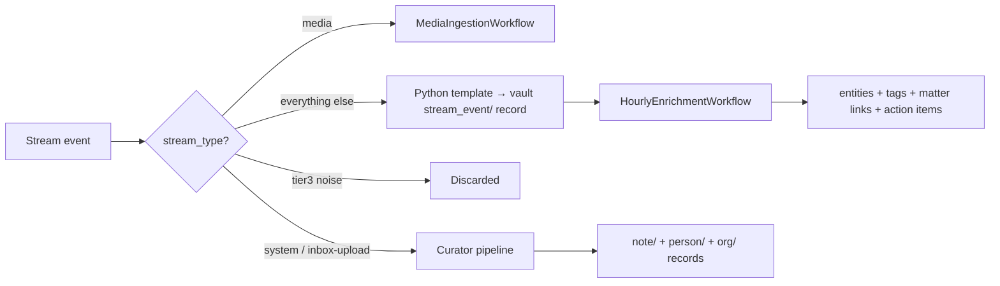

<Note>
The data layer is everything that flows in. The vault is what it becomes; the semantic layer is what it means.
</Note>

## Sir's world, structured on arrival

Sir doesn't manually file his life into Alfred. Connected apps, inbound emails, voice transcripts, manual uploads, channel messages — they all converge on the same intake pipeline. Most are turned into structured vault records with zero LLM calls; the LLM is only invoked once an hour, in a single batch, to add entities and tags.

| Path | What's in it | LLM calls |
|---|---|---|
| Stream events (webhooks, direct Composio actions, scheduled pulls) | Calendar events, emails, GitHub PRs, Slack messages, Notion pages, payments, Telegram messages, voice-call transcripts, Plane issues, Vexa transcripts | Zero per event; one per ~200 events per hour |
| Manual inbox uploads | Meeting notes, PDFs, transcribed audio, files dropped through the dashboard | Curator's 4-stage pipeline (1 + N entity calls per file) |
| Channel inbound (authorized senders) | Email, SMS, Slack, voice from people Sir has authorized | Full conversational turn |
| Channel inbound (everyone else) | Same channels, unauthorized senders | Same as stream events — zero on arrival |

## The StreamEvent envelope

Every event from every source — Composio, webhook, scheduled pull, channel ingest — is wrapped in the same shape and dropped into a JSONL file under `/mnt/encrypted/alfred/streams/<stream_id>.jsonl`.

```json
{
  "id": "ba0865d5-72fe-4bd9-863f-dd7adb57bb79",
  "stream_id": "composio-googlecalendar-events-list",
  "stream_type": "composio",
  "received_at": "2026-04-25T18:55:07.020Z",
  "source_ref": "composio:_74q38db26hgm",
  "raw": { ... },
  "summary": "1:1 with Robert Clarke",
  "metadata": { "event_type": "item", "parser": "composio" }
}
```

| Field | Purpose |
|---|---|
| `id` | UUID — unique per event |
| `stream_id` | Which configured stream produced it |
| `stream_type` | `composio`, `webhook`, `scheduled`, `system`, `media`, `agentmail`, `sms`, `voice-call`, `inbox-upload` |
| `received_at` | When ctrl-api accepted the event |
| `source_ref` | Source-side identifier — the deduplication key. The same value never gets processed twice. |
| `raw` | The unmodified payload |
| `summary` | One-line human description |
| `metadata` | Parser-extracted structured fields |

The JSONL files are the source of truth — there's no shadow database. Stream event counts on the dashboard are computed by reading the files.

<Note>
Once a stream event has been processed by the signal extractor, downstream reasoning works against the resulting `signal/` records — see [Signal layer](/architecture/signal-layer) for the next-stage processing and the lifetime guarantee on signals.
</Note>

## How events arrive

There are five doors into the JSONL.

<AccordionGroup>
<Accordion title="Composio stream pullers (1,000+ apps, fallback path)" icon="puzzle-piece">
The historical primary path, now a fallback. When Sir connects an app via OAuth on the Apps page, the `POST /api/v1/integrations/connect` endpoint registers the OAuth credential with Composio's vault, then auto-creates a stream backed by a Composio action (`packages/ctrl/src/api/routes/integrations.ts`). On the schedule, `StreamPullerWorkflow` calls the Composio SDK, gets back fresh items, and pushes each into `/api/v1/streams/ingest`.

| Source | Action | Sync mode | Cadence |
|---|---|---|---|
| Google Calendar | `GOOGLECALENDAR_EVENTS_LIST` | `sync` (true delta via `nextSyncToken`) | every 5 min |
| Gmail | `GMAIL_LIST_MESSAGES` | `append` (after timestamp) | every 5 min |
| GitHub | `GITHUB_LIST_NOTIFICATIONS` | `append` (since last pull) | every 5 min |
| Notion | `NOTION_FETCH_PAGES` | `append` (last edited) | every 10 min |
| Slack, Linear, Stripe, Asana, Todoist, Drive, Zoom, ... | varies | varies | varies |

A 410 Gone from Composio (sync token expired) triggers a sync reset and full backfill on the next run. Credentials never touch Sir's VPS — Composio holds them.

Stream pullers exist for sources without webhook support, but webhooks (Plane, Vexa, GitHub, Stripe, Polar) and direct Composio actions invoked by the agent are the primary modern paths. On david specifically, all 7 composio stream pullers are paused — superseded by direct integrations and webhook receivers. Composio remains in use for outbound actions; see the **Connected Apps and the Composio gateway** section below.
</Accordion>

<Accordion title="Scheduled HTTP pull" icon="clock">
Generic HTTP-pull engine for sources that aren't on Composio. `StreamPullerWorkflow` (`packages/learn/src/workflows/stream_puller.py`) loads the stream config from ctrl-api, resolves the auth header, calls the configured `pull_endpoint`, runs the per-source parser, and ingests parsed events. Used today for Omi and any custom stream registered via `POST /api/v1/streams`.
</Accordion>

<Accordion title="Webhook push" icon="bolt">
External services POST events directly. Each webhook stream has a unique URL and an HMAC signing secret. The SaaS host's `webhookReceiver.ts` validates, wraps, and proxies to the tenant's `POST /api/v1/streams/ingest`. Used today for Polar (payments), GitHub webhooks, Stripe, Clockify, and arbitrary custom integrations.
</Accordion>

<Accordion title="System hook (OpenClaw sessions)" icon="message">
Every conversation Sir has with Alfred — Slack DM, dashboard chat, email thread, SMS, voice call — produces a session in OpenClaw. The `alfred-inbox` hook in the openclaw container appends each completed session as a StreamEvent into `/mnt/encrypted/alfred/streams/system-openclaw-sessions.jsonl`. No polling — the hook fires on the gateway side, in-process.
</Accordion>

<Accordion title="Manual inbox upload" icon="inbox">
Files dropped onto the dashboard's Inbox page or POSTed to `/api/v1/vault/inbox` land in `vault/inbox/`. The `streams/inbox/scan` endpoint detects MIME type and emits a StreamEvent — `stream_type: "media"` for binaries (audio, image, PDF), `stream_type: "inbox-upload"` for text. These take a different downstream path — see [The two pipelines](#the-two-pipelines) below.
</Accordion>
</AccordionGroup>

## The two pipelines

Once an event lands in the JSONL, `EventProcessorWorkflow` picks it up every fifteen minutes (`packages/learn/src/workflows/event_processor.py`, registered in `packages/learn/scripts/register_schedules.py`) and dispatches based on `stream_type`:



**Manual uploads** go through the Curator's full 4-stage pipeline — see [Agent](/architecture/agent#curator). They produce a richly cross-linked `note/` record plus any new `person/` and `org/` records.

**Stream events** (calendar, email, GitHub, Slack, Notion, payment, SMS, voice-call, openclaw chat, Omi, Vexa, Plane) take the zero-LLM path. `stream_vault.py` dispatches the event to a per-source Python template:

| `stream_type` / `event_type` | Template |
|---|---|
| Calendar (`raw.start` + `raw.end` present) | `_template_calendar` — title, time, location, organizer, attendees, description |
| `email` / `gmail` / `agentmail` | `_template_email` — sender, recipient, subject, snippet |
| `github*` | `_template_github` — repo, action, title, URL |
| `slack*` | `_template_slack` |
| `page` / `notion*` | `_template_notion` |
| `payment` / `polar*` | `_template_payment` |
| `sms` / `sms-inbound` | `_template_sms` |
| `voice-call` | `_template_voice_call` |
| anything else | `_template_generic` |

Each template returns a `(name, body, tags)` tuple. The result is written as a vault `stream_event/` record with `enrichment_status: pending` and `signal_extracted_at: null` in its frontmatter (`packages/learn/src/activities/stream_vault.py`). Total cost: zero LLM calls, a few milliseconds per event.

<Note>
**Path unification (T6.6.1).** All NEW stream events land in `vault/stream_event/<source>-<date>-<hash>.md`. The legacy split — `vault/event/<src>-<ts>-<hash>.md` for most templates and `vault/conversation/<...>.md` for Omi / voice-call / openclaw-chat — is deprecated. Pre-T6.6 records were relocated by `packages/learn/scripts/migrate_to_stream_event.py`.

The `vault/event/` directory is **not** empty — it still holds steward audit records (`steward-action-*.md`, `signal-action-*.md`, `auto-task-created-*.md`) emitted by the steward, signal-action, and task-creation code paths. Those are deliberately not stream events; they're decision audit trail and live forever.
</Note>

### Stream-event retention and purge

Stream-event records are ephemeral. Their job is to feed the signal extractor; once extraction succeeds the relevant `raw_quote` is preserved on the resulting `signal/` record (see [Signal layer](/architecture/signal-layer)), so the source event is then redundant after a 7-day grace window.

`StreamEventPurgeWorkflow` (`packages/learn/src/workflows/stream_event_purge.py`) runs daily at 03:00 UTC via the `al-stream-event-purge` schedule. Each tick:

1. Lists `stream_event/*.md` via ctrl-api.
2. Deletes any record where `frontmatter.signal_extracted_at` is set AND `frontmatter.created` is older than 7 days.
3. Counts listed / purged / kept / errors and surfaces them in the Temporal UI.

Records under `event/` and `conversation/` are **never** touched by this workflow. Signal records (`signal/*.md`) are **never** purged — they are the permanent audit trail for routing decisions. The purge is gated on `STEWARD_STREAM_EVENT_PURGE_ENABLED=true` at registration time; david-only at T6.6.4, fleet rollout post-Phase-6.7.

## Hourly enrichment — one call for ~200 records

Every hour, `HourlyEnrichmentWorkflow` (`packages/learn/src/workflows/hourly_enrichment.py`) runs:

1. `fetch_pending_enrichment_records` — pull every event record where `enrichment_status: pending`.
2. `batch_enrich_events` — chunk into batches of 200 and send each batch as a single Clerk call. Output: per-record list of entities, tags, related matters, action items, priority hints.
3. `apply_enrichments` — patch each record's frontmatter with the new fields and flip `enrichment_status: enriched`.
4. `ensure_enrichment_entities` — for any extracted entity that doesn't have a `person/` or `org/` record, create one.

Net effect: a tenant doing 800+ stream events a day gets one LLM batch call per hour instead of one per event. Roughly 97% fewer model calls than the previous per-event flow, with the same downstream entity coverage.

<Tip>
The fifteen-minute event-processor tick and the one-hour enrichment tick are deliberate. New events show up in the vault and the dashboard within the quarter-hour, so the agent can answer "what just happened?" without paying per-event LLM cost. Enrichment fills in the entities and tags within the hour, so the agent can answer "who's involved?" by the next time Sir asks.
</Tip>

## Connected Apps and the Composio gateway

Composio is the system that lets Alfred both read from and write to 1,000+ third-party services without storing OAuth credentials on Sir's VPS.

- **Inbound** — Composio polling produces stream events as described above.
- **Outbound** — when the agent wants to send an email, create a calendar event, post a Slack message, update a Notion page, or open a GitHub PR, it calls `composio_execute({ action, arguments })`. That goes to the gateway, which dispatches via `POST /api/v1/composio/execute` on ctrl-api, which `docker exec`s into `alfred-learn` and runs `python -m alfred_learn.composio_run`.
- **Per-app skill** — connecting an app auto-generates a `alfred-composio-<toolkit>/SKILL.md` listing the available actions. The agent reads it and knows what arguments to pass.
- **Per-tenant isolation** — `COMPOSIO_USER_ID` is set per-tenant (never `"default"`); a fallback file at `/mnt/encrypted/alfred/.composio-user-id` covers the case where it's missing from `.env`. Without it, two tenants would share a Composio namespace.

## Channel inbound — authorized vs not

The same data plane handles inbound conversations from Slack, email, SMS, voice, and Telegram. The split is whether the sender is on Sir's authorized list:

- **Authorized senders** (in `/vault/.auth/authorized_senders.json` for email, `/mnt/encrypted/alfred/.authorized-phone-numbers.json` for SMS/voice) get the full channel path: a one-shot openclaw session is spawned with the message preloaded, the agent reads, reasons, and replies on the same channel.
- **Anyone else** is dropped into the same stream pipeline as everything else: a vault `stream_event/` record via the email/sms/voice-call template, picked up by hourly enrichment, no reply.

This is what makes inbound traffic safe to leave open — random senders can't trigger LLM turns or reach Sir's vault. They show up as events; the agent only thinks when Sir wants it to. See [Channels](/architecture/channels) for the full dispatch.

## Stream lifecycle on the dashboard

`GET /api/v1/streams` returns every configured stream with its status, event count, last-seen timestamp, and pull mode. Each one supports:

- **Pause** / **Resume** — flips the Temporal schedule
- **Edit** — updates pull endpoint, parser, schedule, sync mode
- **Delete** — removes the schedule and the stream config; the JSONL file is left in place
- **Migrate** (Composio streams) — re-creates the schedule pointing at a new Composio action when an integration is reconfigured

Webhook streams additionally show their unique URL and HMAC secret. Composio streams show their toolkit slug and the action they're polling.

<CardGroup cols={2}>
  <Card title="Signal layer" icon="signal-stream" href="/architecture/signal-layer">
    What happens after the stream event lands: extraction, routing, and the permanent signal record.
  </Card>
  <Card title="Semantic layer" icon="brain" href="/architecture/semantic">
    What happens once records exist: embeddings, clustering, learning.
  </Card>
  <Card title="Channels" icon="messages-question" href="/architecture/channels">
    Authorized vs unauthorized inbound, and the dispatch tables for each channel.
  </Card>
</CardGroup>
