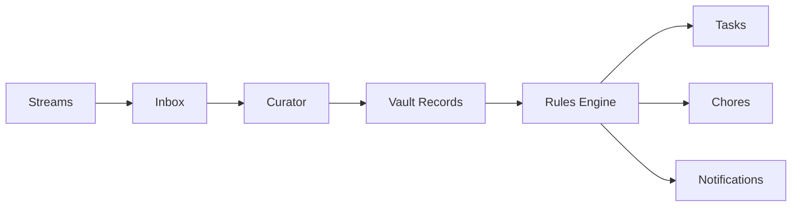

<Note>
This is **Layer 5** of Alfred's [six-layer architecture](/how-it-works). The Kinetic layer turns knowledge into action through durable workflows.
</Note>

## What the Kinetic Layer does

The Kinetic Layer is Alfred's execution engine. It orchestrates when and how work happens — from processing inbox files to running scheduled vault health scans to extracting knowledge on a cron schedule to routing inputs using learned instincts.

## Temporal — the execution engine

[Temporal](https://temporal.io) provides durable workflow orchestration. Unlike simple cron jobs, Temporal workflows are:

- **Durable** — workflows survive process restarts and server reboots
- **Retriable** — failed activities are automatically retried with configurable backoff
- **Observable** — every workflow execution is logged with full history
- **Signalable** — running workflows can receive external signals to change behavior

Temporal runs as a Docker container with SQLite storage on the encrypted volume. You can monitor workflows from the Workflows section of your dashboard or via the API.

## Tasks, Chores & Rules

Beyond automated workflows, Alfred turns vault knowledge into proactive action:

- **Tasks** — One-off action items Alfred creates and tracks. Identified from conversations ("I should call the accountant next week"), emails, ambient recordings, or created directly via the dashboard
- **Chores** — Recurring scheduled jobs: daily briefings, weekly grocery lists, monthly expense reports — each backed by a Temporal workflow running on a cron schedule
- **Rules** — If/then automation in natural language. "When an invoice arrives by email, extract the amount and due date, then create a task three days before it's due."

A single ambient recording can generate a vault record, trigger a rule, create a task, and schedule a chore — all without you doing anything beyond having the conversation.

<Warning>
Tasks, Chores, and Rules are coming soon. The Temporal engine and specialist workflows are fully operational today.
</Warning>

## Background schedules

Alfred runs twelve background processes on automated schedules:

### Specialist processes

| Process | Schedule | What it does |
|---------|----------|-------------|
| Curator | Watches for new files | Reads inbox content and creates structured records |
| Janitor | Periodic sweeps | Scans for and repairs structural issues |
| Distiller | On-demand + scheduled | Surfaces latent knowledge from records |
| Surveyor | On-demand + scheduled | Embeds, clusters, and discovers relationships |

### Intuition processes

| Process | Schedule | What it does |
|---------|----------|-------------|
| Event Processor | Every 2 minutes | Reads incoming stream events and writes vault records |
| Session Tracker | Every 5 minutes | Groups related records into sessions |
| Daily Digest | Daily at 6pm | Summarizes the day's activity |
| Learning | Every 5 minutes | Captures observations from your routing decisions |
| Reflection | Daily at 2am | Reviews observations and refines instincts |
| Judgment | Every 2 minutes | Routes inputs using instincts, escalates uncertain ones |

All processes are managed by the Temporal Engine and can be monitored from the Workflows section of your dashboard.

<Columns cols={2}>
  <Card title="Tasks, Chores & Rules" icon="list-check" href="/features/automation">
    The actions Alfred takes on your behalf
  </Card>
  <Card title="Workflow API" icon="diagram-project" href="/api-reference/workflows/list">
    Full workflow management endpoints
  </Card>
</Columns>
