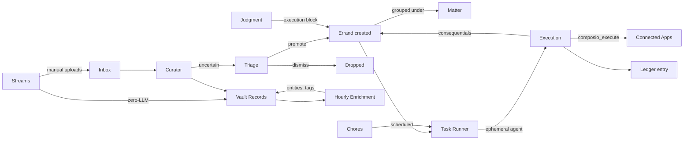

<Note>
Part of Alfred's [six-layer architecture](/how-it-works). The Kinetic layer turns knowledge into action.
</Note>

## Alfred acts, not just remembers

Your vault holds what Alfred knows. But knowledge without action is just a filing cabinet. The Kinetic layer is where understanding becomes execution — handling the things that need doing so you don't have to.

## Temporal — the execution engine

[Temporal](https://temporal.io) provides durable workflow orchestration. Unlike simple cron jobs, Temporal workflows survive process restarts, automatically retry failed activities, log full execution history, and accept external signals. It runs as a Docker container on your encrypted volume.

Every specialist, every intuition process, and every scheduled job runs as a Temporal workflow. You can monitor them from the Workflows section of your dashboard or via the API.

## Matters

Matters are standing concerns that group related work. Think of a matter as an ongoing area of attention — "Kitchen renovation", "Q2 product launch", or "Tax preparation". A matter doesn't have a status lifecycle of its own; it exists as long as it's relevant and collects the errands that belong to it.

When the Curator or Judgment identifies work that relates to an existing matter, new errands are automatically grouped under it. This gives you a single place to see everything associated with a concern, rather than a flat list of unrelated tasks.

## Errands

Errands are the execution units of the Kinetic layer — actionable tasks Alfred carries out on your behalf. They originate from everywhere:

- **Instincts** — when Judgment matches an instinct with an execution block, it creates an errand automatically
- **Conversations** — "I should call the accountant next week" becomes an errand
- **Your dashboard** — create errands directly when you know what needs doing
- **Triage** — items you promote from the triage queue become errands
- **Consequentials** — completing one errand can spawn follow-up errands

Each errand has an **owner** (`alfred` or `human`), a **tier** that governs its power, and optionally a **skill** — a methodology file that tells Alfred how to approach the work. Errands belong to a Matter when one exists.

### Status lifecycle

Every errand moves through a defined lifecycle:

`todo` → `active` → `blocked` → `done`

- **todo** — queued and waiting for the Task Runner (or you) to pick it up
- **active** — currently being worked on
- **blocked** — waiting on a dependency, another errand, or external input
- **done** — completed, with a ledger entry recording what happened

## Triage

Not everything that arrives deserves immediate processing. When the Curator encounters an item it's uncertain about — ambiguous intent, low confidence, or potentially sensitive — it routes the item to the **Triage queue** instead of acting on it.

Triage items sit in your dashboard waiting for a human decision:

- **Promote** — convert to an errand (optionally assigning it to a matter)
- **Dismiss** — discard the item; Alfred learns from the dismissal

This keeps Alfred from acting on things it shouldn't while ensuring nothing important falls through the cracks.

### Tiers

| Tier | Profile | Capabilities | Turn budget |
|------|---------|-------------|-------------|
| **1** | Fast and cheap | Read-only vault access | 10 turns |
| **2** | Capable | Read and write vault access | 25 turns |
| **3** | Full power | Everything — vault, tools, external | 50 turns |

### The Task Runner

The Task Runner is a Temporal workflow that runs every 15 minutes, picking up errands with `status=todo` and `owner=alfred`. For each errand, it follows a pipeline:

1. **Check prerequisites** — verify `depends_on` and `blocked_by` are clear
2. **Mark active** — set the errand to `active` so it's visible in your dashboard
3. **Assemble context** — gather the skill methodology, related matter, and relevant observations
4. **Execute** — run the work via OpenClaw `sessions_spawn` with full tool access, bounded by the tier's turn budget
5. **Write artifacts** — create or update vault records as the skill directs
6. **Mark done** — close the errand and write a ledger entry recording what happened
7. **Handle consequentials** — spawn any follow-up errands that flow from the completed work

Errands owned by `human` skip the runner entirely — they appear on your dashboard for you to handle at your discretion.

### Skills as methodology

When an errand references a skill, the Task Runner doesn't just execute blindly — it follows the skill's reasoning methodology. Skills are plain English files in your vault's `skill/` folder that describe how to approach a type of work: what to look for, what questions to ask, what patterns to follow, what to produce.

This means Alfred's execution is transparent and auditable. You can read the skill, understand the methodology, and refine it over time.

## Ledger entries

Every completed errand produces a **ledger entry** — a consequential record that captures what was done, what was produced, and what follow-up errands (if any) were spawned. Ledger entries are stored as vault records, making them searchable and linkable.

Ledger entries serve three purposes:

- **Audit trail** — you can always see exactly what Alfred did and why
- **Continuity** — follow-up errands reference the ledger entry that created them, maintaining a chain of causation
- **Learning** — the Distiller and Reflection processes use ledger entries to refine instincts over time

## Chores

Chores are recurring scheduled jobs that Alfred generates, validates, and runs automatically. Unlike static templates, every chore is a **bespoke Python Temporal workflow** generated by Opus specifically for your needs during onboarding.

### How chores are created

During onboarding, Alfred analyses your email patterns, relationships, and financial activity, then generates a set of personalised chores. Each chore is:

1. **Written as a Python Temporal workflow** by Opus, tailored to your data and habits
2. **Statically validated** — syntax check, import verification
3. **Smoke-tested** in a subprocess sandbox — dry-run to catch runtime errors before deployment
4. **Deployed** to `/alfred-data/user-chores/` where the dynamic loader picks them up on next worker restart

### Quarantine

The first 3 runs of every generated chore are **dry-run** — no notifications sent, no vault writes. If all 3 dry-runs complete without errors, the chore is auto-released to production. This protects against hallucinated code that looks correct but fails on real data.

### Examples of generated chores

| Chore | Schedule | What it does |
|-------|----------|-------------|
| **Weekly Cash Flow Forecast** | Sundays at 6pm | Reads financial transactions from vault, projects upcoming expenses |
| **Gym and Health Check-in** | Weekdays at 6pm | Reviews health/activity data, tracks gym visit patterns |
| **Property and Home Digest** | Fridays at 7pm | Aggregates property-related emails, bills, maintenance items |
| **Deferred Obligations Tracker** | Daily at 6pm | Scans for promises/commitments approaching their deadlines |

### Managing chores

From the **Chores tab** in the Intelligence section of your dashboard:

- **Pause/Resume** — temporarily stop a chore's schedule
- **Trigger** — manually fire a chore outside its normal schedule
- **Delete** — remove the chore and its Temporal schedule
- **View source** — see the full generated Python workflow code
- **Dependency audit** — check which vault data sources each chore depends on and whether that data exists

## Rules

Rules are if/then automation defined in natural language. Tell Alfred what to watch for and what to do about it.

> "When an invoice arrives by email, extract the amount and due date, then create a task three days before it's due."

> "If anyone mentions a new competitor in a meeting, create a record and notify me."

Rules are evaluated continuously against incoming stream events and vault changes. When a condition matches, Alfred executes the action — creating a task, sending a notification, updating a record, or triggering a chore.

A stream event becomes a vault record instantly (zero LLM). Enrichment adds intelligence in batch. Judgment routes to execution via ephemeral agents that can call connected app actions. Chores fire on schedule through the same Task Runner. The entire cycle runs autonomously — from data arriving to actions being taken.

<Warning>
Rules (if/then natural-language automation) are in active development. Currently, the same behaviour is achieved through instincts — Alfred learns patterns from your instructions and executes them via the judgment → task runner → ephemeral agent pipeline.
</Warning>

## Background processes

Alfred runs automated processes on schedules you don't need to manage. They take care of themselves.

<AccordionGroup>
<Accordion title="Specialist processes" icon="gears">
| Process | Schedule | What it does |
|---------|----------|-------------|
| Curator | Watches for new files | Reads manual inbox uploads and creates structured records |
| Janitor | Periodic sweeps | Scans for and repairs structural issues |
| Distiller | On-demand + scheduled | Surfaces latent knowledge from records |
| Surveyor | On-demand + scheduled | Embeds, clusters, and discovers relationships |
</Accordion>

<Accordion title="Stream & enrichment processes" icon="wave-pulse">
| Process | Schedule | What it does |
|---------|----------|-------------|
| Event Processor | Every 15 minutes | Creates vault records from stream events (zero LLM) |
| Stream Pullers | Per-stream schedule (2–10 min) | Polls connected apps via Composio for new data (per-stream Temporal schedules, not a global workflow) |
| Hourly Enrichment | Every 1 hour | Batched LLM call to add entities, tags, priorities to new records |
| Session Tracker | Every 15 minutes | Groups related records into sessions |
| Daily Digest | Daily at 6pm | Summarises the day's activity |
</Accordion>

<Accordion title="Intuition processes" icon="brain">
| Process | Schedule | What it does |
|---------|----------|-------------|
| Learning | Every 15 minutes | Captures observations from conversations and stream events |
| Reflection | Daily at 2am | Reviews observations and refines instincts |
| Judgment | Every 15 minutes | Routes inputs using instincts; creates execution tasks |
| Task Runner | Every 15 minutes | Picks up queued errands, spawns ephemeral agents for execution |
| Chore Promotion | Weekly (Sunday 3am) | Scans generated chores for promotion to standard library |
</Accordion>

<Accordion title="Infrastructure processes" icon="server">
| Process | Schedule | What it does |
|---------|----------|-------------|
| Nightly Maintenance | Daily at 3am | Vault cleanup, stream pruning, index rebuilds (Temporal) |
| Health monitoring | Every 1 minute | Checks service status, disk, memory, connectivity (SaaS-side, not Temporal) |
| Encrypted backups | Daily at 3am | Restic backup to Hetzner Object Storage (cron, not Temporal) |
</Accordion>
</AccordionGroup>

Temporal-based processes can be monitored from the Workflows section of your dashboard. Infrastructure processes (health, backups) run outside Temporal.

<Columns cols={2}>
  <Card title="Your Specialists" icon="gears" href="/guides/your-ai-agents">
    Monitor and direct your specialists
  </Card>
  <Card title="Workflow API" icon="diagram-project" href="/api-reference/workflows/list">
    Full workflow management endpoints
  </Card>
</Columns>
