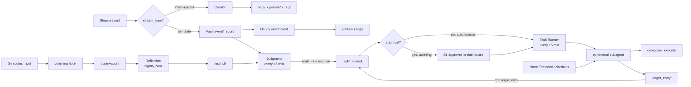

<Note>
The kinetic layer turns knowledge into action. The semantic layer figures out what something is; this layer decides what to do about it and does it.
</Note>

## A vault that does things

Sir's vault knows. The kinetic layer makes Alfred act on what's known. It's organised around five concepts — matters, errands, chores, instincts, and execution tasks — all coordinated by Temporal workflows running inside the `alfred-learn` container.

| Concept | Vault type | Created by | Acted on by |
|---|---|---|---|
| Matter | `matter/` | Onboarding pack, Sir, Curator | Errands group under it; chores reference it |
| Errand | `task/` | Sir, Curator, Judgment, Conversation | Sir (if owner=human) or the Task Runner (if owner=alfred) |
| Chore | `chore/` | Onboarding pack (Opus generates bespoke Python) | Its own Temporal schedule + the dynamic loader |
| Instinct | `instinct/` | Reflection (nightly synthesis of observations) | Judgment (every 15 min) |
| Execution task | `task/` (with `created_by: judgment`) | Judgment when an instinct's execution block fires | Task Runner → ephemeral subagent |

Temporal is the substrate. Every recurring job, every pickup loop, every retry policy, every workflow restart-on-failure is a Temporal primitive. Workflow state lives at `/mnt/encrypted/temporal/`, durable across container restarts.

## Matters — standing concerns

A matter is an ongoing area of attention. "Growing Family & Second Baby Preparation". "Eagle Farm Construction". "Q2 Product Launch". It has no status lifecycle of its own — it exists while it's relevant and it collects the errands that belong to it.

When the Curator creates errands from a meeting note, or when Judgment matches an instinct that names a matter, the new errand is grouped under it. The dashboard's matter detail view then shows everything connected: errands, conversations, decisions, ledger entries, related people and organisations.

The first batch of matters comes out of onboarding — the matter pack generator (`packages/learn/src/activities/packs_opus.py`) reads Sir's email behavioural profile and produces ~10 matter records personalised to the patterns it found.

## Errands — units of work

An errand is `task/` with an owner and a tier. Owners are either `alfred` (he'll attempt it) or `human` (Sir handles it). The status lifecycle is fixed:

```
todo → active → blocked → done
```

Errands carry:

- **owner** — `alfred` or `human`
- **tier** — 1 (read-only, 10-turn budget), 2 (read+write vault, 25-turn budget), 3 (full tools, 50-turn budget)
- **skill_entry** — optional methodology file in the vault's `skill/` folder. If set, the Task Runner reads it as the agent's plan rather than improvising.
- **matter** — optional grouping
- **depends_on**, **blocked_by** — prerequisite errands or files
- **requires_approval** — if true, the Task Runner won't pick it up until Sir explicitly approves it from the dashboard

Errands originate from many places:

- Onboarding's errand pack — Opus reads matters and behavioural profile to seed ~10 errands per tenant
- The Curator — extracted from inbox uploads
- Judgment — when an instinct with an execution block fires
- A chore's run — chores can spawn follow-up errands
- Sir — created directly through the dashboard or through chat ("add an errand to follow up with Robert next week")
- A previous errand's ledger entry — consequentials chain

## The Task Runner

Source: `packages/learn/src/workflows/task_runner.py`. Schedule: every 15 minutes. Picks up to 5 queued errands per tick.

For each errand:

<Steps>
  <Step title="Check prerequisites">
    Are `depends_on` and `blocked_by` clear? If not, skip.
  </Step>
  <Step title="Mark active">
    Flip the status so the dashboard reflects the work in progress.
  </Step>
  <Step title="Assemble context">
    Load the matter, the related observations, the skill methodology if set, recent ledger entries from the same matter.
  </Step>
  <Step title="Spawn an ephemeral subagent">
    `create_ephemeral_agent` writes a scoped agent entry into the workers' `openclaw.json`. Tools are limited to what the instinct's execution block declared. The workers gateway hot-reloads (~10–15s); `wait_for_agent_ready` blocks until it's healthy.
  </Step>
  <Step title="Execute">
    `sessions_spawn` against `http://openclaw-workers:18790` runs the work inside the fresh agent, bounded by the tier's turn budget.
  </Step>
  <Step title="Write artifacts">
    Vault records produced during execution are written through ctrl-api. The errand is marked `done`; a `ledger_entry` is created with what happened and how long it took.
  </Step>
  <Step title="Handle consequentials">
    Any follow-up errands the agent identified are created and queued.
  </Step>
  <Step title="Tear down the subagent">
    `delete_ephemeral_agent` removes the entry. The workers gateway hot-reloads back to its previous shape.
  </Step>
</Steps>

Errands with `owner: human` are skipped entirely — they sit in the dashboard for Sir.

## Skills as methodology

When an errand carries `skill_entry: skill/weekly-digest.md`, the Task Runner reads that file and uses it as the agent's reasoning plan. Skills are plain English Markdown — what to look for, what questions to ask, what patterns to follow, what to produce. They live in the vault, not in code, so Sir can read them, edit them, and refine them as Alfred's behaviour evolves.

This means execution is auditable. Every errand's ledger entry references the skill that guided it; reading the skill tells Sir exactly what Alfred was trying to do.

## Chores — recurring scheduled work

A chore is a recurring Temporal workflow. Unlike a stock cron job, every chore is a **bespoke Python workflow generated by Opus** specifically for Sir's needs.

### How a chore is created

During onboarding, the chores stage runs the bespoke generation pipeline (`packages/learn/src/activities/chore_generation.py`). For each opportunity surfaced by the brief stage:

1. **Match against standard library.** A few common chores (subscription watcher, weekly matter digest) live in `packages/learn/src/workflows/chores/`. If the opportunity matches, the standard one is used.
2. **Generate.** If no match, Opus drafts a Python Temporal workflow targeted at the opportunity. The prompt includes the activity manifest (what helper activities are available — `fetch_financial_events`, `write_matter_digest_via_llm`, etc.), worked-example templates, and the opportunity's data shape.
3. **Validate.** `validate_template_source` runs a syntax check, an import check, and confirms the workflow has the expected `@workflow.defn` decorator and emits its own schedule cron in a header comment.
4. **Smoke test.** A subprocess sandbox runs the workflow against fake input. If it crashes, the prompt is amended and Opus retries — up to three attempts per opportunity.
5. **Deploy.** The validated source is written to `/alfred-data/user-chores/<module>.py` and the dynamic loader picks it up on the next worker restart (`packages/learn/src/workflows/chores/_dynamic_loader.py`).

Each chore deploys with its own cron schedule (declared in a header comment), its own activity dependencies, and its own user-facing description.

### Quarantine — three dry-runs before production

The first three runs of every generated chore are **dry-run**: no notifications sent, no vault writes. If all three complete without errors, the chore auto-releases. This catches the case where Opus produces code that looks correct but fails on real data — a hallucinated field name, a missing key — before Sir ever notices.

### Examples

| Chore | Schedule | What it does |
|---|---|---|
| Weekly Cash Flow Forecast | Sundays at 18:00 | Reads financial events from the vault, projects upcoming expenses |
| Gym & Health Check-in | Weekdays at 18:00 | Reviews health stream events, tracks gym attendance |
| Property & Home Digest | Fridays at 19:00 | Aggregates property-related emails, bills, maintenance items |
| Deferred Obligations Tracker | Daily at 18:00 | Scans for promises and commitments approaching their deadlines |

### Source visibility

Every chore is auditable from the dashboard. `GET /api/v1/chores/{slug}/source` returns the full generated Python code plus a dependency audit: which activities the workflow imports, what each one reads from and writes to, and a live data-readiness probe against the vault directories the activities depend on. This catches "the weekly cashflow forecast has no data source" before the chore silently produces nothing for a month.

### Promotion to standard library

`packages/learn/src/workflows/chore_promotion.py`. Runs Sundays at 03:00. Walks every tenant's `/alfred-data/user-chores/` directory, filters to templates that have proven useful (minimum runs and success rate), and asks Opus to draft a promotion pull-request description. Drafts are persisted; a separate process can opt to file them as actual GitHub PRs against the standard library. Useful generated chores graduate; the rest stay personal to one tenant.

### Output goes through Sir's main agent

A chore never sends Slack messages or pushes notifications directly. When it has something to deliver, it dispatches via `POST /api/v1/notifications` — which routes through Sir's main agent on the right channel, with the right voice. This keeps Sir's experience of Alfred consistent across every interaction; he never receives a message that sounds different from the rest of his butler.

## Instincts and execution tasks

Instincts are described in [Semantic](/architecture/semantic#intuition--alfred-learns-how-sir-routes). What kinetic adds is what happens when an instinct says **act**, not just **route**.

The instinct schema includes an optional `execution:` block (`packages/learn/src/activities/packs_opus.py`):

```yaml
execution:
  enabled: true
  task_title_template: "Reply to {sender}: {subject}"
  tier: 2
  requires_approval: true
```

When Judgment matches an instinct with `execution.enabled: true` above the discretion threshold, it doesn't just record the routing — it calls `_create_execution_task` (`packages/learn/src/activities/judge.py`), which writes a `task/` record with `owner: alfred`, `created_by: judgment`, and the requested tier and approval flag.

### The trust gradient

`requires_approval` isn't taken at face value. The activity overrides it based on how much evidence the instinct has accumulated:

| Observations behind the instinct | Effective `requires_approval` |
|---|---|
| < 10 | Forced `true` regardless of what the instinct declared |
| 10–49 | Use the instinct's declared value |
| 50+ AND match score > 0.75 | Defaults to `false` (full autonomy unless Sir's pattern says otherwise) |

This is **discretion** — a good butler's most important quality. Alfred starts cautious. As evidence accumulates that he reads the situation correctly, he asks less and acts more. The slope is gentle on purpose.

### Approval flow

When an execution task lands with `requires_approval: true`, the dashboard shows it with **Approve** / **Reject** buttons. Approve patches the frontmatter to set `approved: true`; the Task Runner picks it up on the next tick. Reject deletes the task and writes an observation that becomes evidence against the instinct in the next reflection — Alfred learns from the rejection.

## The full loop



A stream event becomes a vault record instantly. Hourly enrichment adds intelligence in batch. Judgment routes — sometimes to action. Action runs in an ephemeral subagent with scoped tools. Every action produces a ledger entry. Chores feed into the same execution path on their own schedules. The loop is always running; Sir watches as much or as little of it as he likes.

## What runs when

| Workflow | Schedule | Source |
|---|---|---|
| EventProcessorWorkflow | every 15 min | `packages/learn/src/workflows/event_processor.py` |
| SessionTrackerWorkflow | every 15 min | `session_tracker.py` |
| LearningWorkflow | every 15 min | `learning.py` |
| JudgmentWorkflow | every 15 min | `judgment.py` |
| TaskRunnerWorkflow | every 15 min | `task_runner.py` |
| HourlyEnrichmentWorkflow | every 1 hour | `hourly_enrichment.py` |
| OmiAudioProcessorWorkflow | every 10 min | `omi_processor.py` |
| DailyDigestWorkflow | daily 18:00 | `daily_digest.py` |
| ReflectionWorkflow | daily 02:00 | `reflection.py` |
| NightlyMaintenanceWorkflow | daily 03:00 | `nightly_maintenance.py` |
| ChorePromotionReflectionWorkflow | weekly Sunday 03:00 | `chore_promotion.py` |
| StreamPullerWorkflow | per-stream interval | `stream_puller.py` |
| Dynamically loaded chores | per-chore cron | `/alfred-data/user-chores/*.py` |

All schedules are registered by `packages/learn/scripts/register_schedules.py` on the worker's first boot, idempotently.

<CardGroup cols={2}>
  <Card title="Interface" icon="display" href="/architecture/interface">
    The dashboard, Vault Nebula, and how Sir directs the kinetic layer.
  </Card>
  <Card title="Workflow API" icon="diagram-project" href="/api-reference/workflows/list">
    Every endpoint for inspecting and steering Temporal workflows.
  </Card>
</CardGroup>
