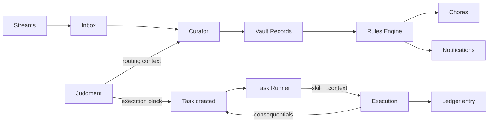

<Note>
Part of Alfred's [six-layer architecture](/how-it-works). The Kinetic layer turns knowledge into action.
</Note>

## Alfred acts, not just remembers

Your vault holds what Alfred knows. But knowledge without action is just a filing cabinet. The Kinetic layer is where understanding becomes execution — handling the things that need doing so you don't have to.

## Temporal — the execution engine

[Temporal](https://temporal.io) provides durable workflow orchestration. Unlike simple cron jobs, Temporal workflows survive process restarts, automatically retry failed activities, log full execution history, and accept external signals. It runs as a Docker container on your encrypted volume.

Every specialist, every intuition process, and every scheduled job runs as a Temporal workflow. You can monitor them from the Workflows section of your dashboard or via the API.

## Tasks

Tasks are the execution primitives of the Kinetic layer — errands Alfred carries out on your behalf. They originate from everywhere:

- **Instincts** — when Judgment matches an instinct with an execution block, it creates a task automatically
- **Conversations** — "I should call the accountant next week" becomes a task
- **Your dashboard** — create tasks directly when you know what needs doing
- **Consequentials** — completing one task can spawn follow-up errands

Each task has an **owner** (`alfred` or `human`), a **tier** that governs its power, and optionally a **skill** — a methodology file that tells Alfred how to approach the work.

### Tiers

| Tier | Profile | Capabilities | Turn budget |
|------|---------|-------------|-------------|
| **1** | Fast and cheap | Read-only vault access | 10 turns |
| **2** | Capable | Read and write vault access | 25 turns |
| **3** | Full power | Everything — vault, tools, external | 50 turns |

### The Task Runner

The Task Runner is a Temporal workflow that runs every 2 minutes, picking up tasks with `status=queued` and `owner=alfred`. For each task, it follows a pipeline:

1. **Check prerequisites** — verify `depends_on` and `blocked_by` are clear
2. **Mark active** — set the task to `active` so it's visible in your dashboard
3. **Assemble context** — gather the skill methodology, related matter, and relevant observations
4. **Execute** — run the work via `sessions_spawn`, bounded by the tier's turn budget
5. **Write artifacts** — create or update vault records as the skill directs
6. **Mark done** — close the task and write a ledger entry recording what happened
7. **Handle consequentials** — spawn any follow-up errands that flow from the completed work

Tasks owned by `human` skip the runner entirely — they appear on your dashboard for you to handle at your discretion.

### Skills as methodology

When a task references a skill, the Task Runner doesn't just execute blindly — it follows the skill's reasoning methodology. Skills are plain English files in your vault's `skill/` folder that describe how to approach a type of work: what to look for, what questions to ask, what patterns to follow, what to produce.

This means Alfred's execution is transparent and auditable. You can read the skill, understand the methodology, and refine it over time.

## Chores

Chores are recurring scheduled jobs Alfred runs automatically on a cadence you define. Standing instructions, handled without you lifting a finger.

| Chore | Schedule | Delivery |
|-------|----------|----------|
| **Daily Briefing** | Every morning at 7am | SMS, email, or voice call |
| **Weekly Grocery List** | Every Sunday at 10am | SMS or email |
| **Monthly Expense Report** | First of each month | Email with attachment |

Each chore is backed by a Temporal workflow running on a cron schedule. When the schedule fires, Alfred assembles the output — pulling from your vault, checking external sources, applying your preferences — and delivers the result through your preferred channel.

<Warning>
Coming soon — Chores are in active development.
</Warning>

## Rules

Rules are if/then automation defined in natural language. Tell Alfred what to watch for and what to do about it.

> "When an invoice arrives by email, extract the amount and due date, then create a task three days before it's due."

> "If anyone mentions a new competitor in a meeting, create a record and notify me."

Rules are evaluated continuously against incoming stream events and vault changes. When a condition matches, Alfred executes the action — creating a task, sending a notification, updating a record, or triggering a chore.

A single input can be routed by Judgment, processed by the Curator, trigger a task via an instinct's execution block, and spawn follow-up errands — all without you doing anything beyond sharing the content.

<Warning>
Coming soon — Rules are in active development.
</Warning>

## The thirteen background processes

Alfred runs thirteen automated processes. You don't need to manage them — they take care of themselves.

<AccordionGroup>
<Accordion title="Specialist processes" icon="gears">
| Process | Schedule | What it does |
|---------|----------|-------------|
| Curator | Watches for new files | Reads inbox content and creates structured records; accepts routing context from Judgment |
| Janitor | Periodic sweeps | Scans for and repairs structural issues |
| Distiller | On-demand + scheduled | Surfaces latent knowledge from records |
| Surveyor | On-demand + scheduled | Embeds, clusters, and discovers relationships |
</Accordion>

<Accordion title="Intuition processes" icon="brain">
| Process | Schedule | What it does |
|---------|----------|-------------|
| Event Processor | Every 2 minutes | Reads incoming stream events and writes vault records |
| Session Tracker | Every 5 minutes | Groups related records into sessions |
| Daily Digest | Daily at 6pm | Summarizes the day's activity |
| Learning | Every 5 minutes | Captures observations from your routing decisions |
| Reflection | Daily at 2am | Reviews observations and refines instincts |
| Judgment | Every 2 minutes | Routes inputs using instincts and triggers Curator processing; escalates uncertain ones |
| Task Runner | Every 2 minutes | Picks up queued tasks, assembles context with skills, executes via sessions_spawn, writes ledger entries |
</Accordion>

<Accordion title="Infrastructure processes" icon="server">
| Process | Schedule | What it does |
|---------|----------|-------------|
| Health monitoring | Every 2 minutes | Checks service status, disk, memory, connectivity |
| Encrypted backups | Daily at 3am | Restic backup to Hetzner Object Storage |
</Accordion>
</AccordionGroup>

All processes are managed by the Temporal Engine and can be monitored from your dashboard.

<Columns cols={2}>
  <Card title="Your Specialists" icon="gears" href="/guides/your-ai-agents">
    Monitor and direct your specialists
  </Card>
  <Card title="Workflow API" icon="diagram-project" href="/api-reference/workflows/list">
    Full workflow management endpoints
  </Card>
</Columns>
