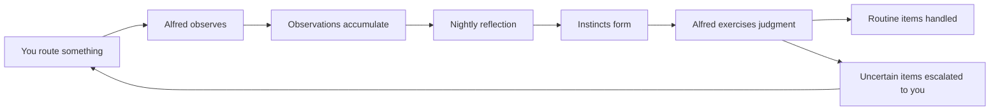

<Note>
This is **Layer 4** of Alfred's [six-layer architecture](/how-it-works). The Semantic layer is where raw data becomes structured knowledge.
</Note>

## The vault — structured knowledge

The vault is an Obsidian-compatible collection of Markdown files with YAML frontmatter. Every piece of knowledge Alfred manages is a `.md` file with a defined type, structured metadata, and wikilinks to related records.

The vault lives on the LUKS-encrypted volume, organized into directories by record type. You can browse it from your dashboard, access it via the API, or open it directly in Obsidian.

## 22 record types across four layers

### Standing entities (7)

The stable elements of your world: `person`, `org`, `project`, `location`, `account`, `asset`, `process`. These persist and accumulate connections over time.

### Activity records (7)

What happened: `conversation`, `note`, `task`, `event`, `session`, `input`, `run`. These capture events, work, and interactions, linking to the people and things involved.

### Learning types (5)

What we know — created by the Distiller from your records: `assumption`, `decision`, `constraint`, `contradiction`, `synthesis`. These surface the knowledge hiding between the lines.

### Intuition types (3)

How Alfred learns — created by Alfred's intuition system: `observation`, `instinct`, `reflection`. These grow over time as Alfred learns your preferences and develops the judgment to handle routine decisions on your behalf.

## How records connect

Every record can reference other records through wikilinks. When the Curator creates a person mentioned in a conversation, both records automatically link to each other. Over time, these connections build a rich, navigable map of your world.

**Example:** You share notes from a planning meeting:

1. The **Curator** creates records: 3 people, 1 project, 2 tasks, 1 decision, and the conversation itself — all cross-linked
2. The **Janitor** verifies all links are valid and metadata is consistent
3. The **Distiller** later surfaces an assumption ("we're assuming the API will be ready by March") and a constraint ("budget is capped at $50k") — both linked back to the source records
4. The **Surveyor** clusters these records with existing ones, revealing that this meeting's topics overlap with three other recent discussions

Your vault grows richer with everything you share.

## Intelligence — learning from your patterns

Beyond the Distiller's knowledge extraction, Alfred develops **intuition** — the accumulated understanding of how you work.

- **Observations** — When you route an input, Alfred records the decision and the signals that characterized it
- **Reflection** — Every night at 2am, Alfred reviews observations and distills them into instincts
- **Judgment** — When new inputs arrive, Alfred scores them against its instincts: handle it, or ask you?

Alfred starts cautious, asking about everything. As evidence accumulates, it gradually handles more on its own — but always errs on the side of asking when uncertain. This is **discretion** — a good butler's most important quality.

<Columns cols={3}>
  <Card title="Your Vault" icon="vault" href="/vault/understanding-your-vault">
    How your records, connections, and world fit together
  </Card>
  <Card title="Record Types" icon="shapes" href="/vault/record-types">
    Detailed reference for all 22 record types
  </Card>
  <Card title="Intuition" icon="brain" href="/guides/intuition">
    How Alfred learns your preferences
  </Card>
</Columns>
