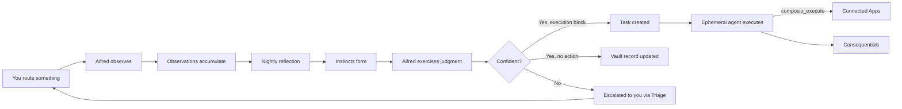

<Note>
Part of Alfred's [six-layer architecture](/how-it-works). The Semantic layer is where raw data becomes structured knowledge.
</Note>

## Your vault

The vault is where Alfred keeps everything it knows about your world. It's a living map — an Obsidian-compatible collection of Markdown files with YAML frontmatter, all connected through wikilinks. Every person, project, task, decision, and insight lives here.

Unlike a folder of notes, your vault is **structured** (every record has a type and metadata), **connected** (records link to each other), and **growing** (Alfred continuously adds and refines records as you share content).

## 26 record types across five layers

<AccordionGroup>
<Accordion title="Standing entities (8) — the stable elements of your world" icon="building">
Records for people, organizations, and resources that persist and accumulate connections over time.

| Type | What it represents |
|------|-------------------|
| `person` | People and contacts |
| `org` | Organizations and companies |
| `project` | Projects and initiatives |
| `location` | Physical or virtual locations |
| `account` | Accounts and subscriptions |
| `asset` | Physical or digital resources |
| `process` | Defined processes and workflows |
| `matter` | An ongoing concern grouping related errands |
</Accordion>

<Accordion title="Activity records (9) — what happened" icon="calendar">
Events, work, interactions, and execution results — capturing what occurred and linking to the people and things involved.

| Type | What it represents |
|------|-------------------|
| `conversation` | Meetings, discussions, dialogue |
| `note` | Observations and freeform content |
| `task` | Execution primitives — errands carried out by Alfred or by you |
| `triage` | Items Alfred couldn't confidently classify — needs your review |
| `event` | One-time occurrences |
| `session` | Time-bounded work periods |
| `input` | Incoming items being attended to |
| `run` | Execution runs and batch operations |
| `ledger_entry` | Completion records — what happened when an errand finished |
</Accordion>

<Accordion title="Execution types (2) — how work gets done" icon="book-open">
Recurring and one-off work units managed by Alfred.

| Type | What it represents |
|------|-------------------|
| `chore` | A recurring scheduled workflow — generated by Opus, validated, and deployed per-tenant |
| `ledger_entry` | An execution log entry — records what Alfred did, when, and the outcome |
</Accordion>

<Accordion title="Learning types (5) — what we know" icon="flask">
Created by the Distiller from your records — the knowledge hiding between the lines.

| Type | What it represents |
|------|-------------------|
| `assumption` | Implicit assumptions found in your records |
| `decision` | Choices made, with rationale |
| `constraint` | Limitations and boundaries |
| `contradiction` | Conflicts between different records |
| `synthesis` | Insights connecting multiple records |
</Accordion>

<Accordion title="Intuition types (3) — how Alfred learns" icon="brain">
Created by Alfred's intuition system as it learns your preferences over time.

| Type | What it represents |
|------|-------------------|
| `observation` | A routing decision Alfred observed and recorded |
| `instinct` | A learned routing pattern, distilled from multiple observations |
| `reflection` | A nightly report on what Alfred learned and refined |
</Accordion>
</AccordionGroup>

## How records connect

Every record can reference other records through wikilinks. When Alfred discovers a person mentioned in an event or document, the enrichment process creates a person record and links it back. Over time, these connections build a rich, navigable map of your world.

**Example:** You share notes from a planning meeting:

1. Alfred creates records: the conversation itself, plus event records for each significant item — all cross-linked
2. The hourly enrichment pass adds entities (3 people, 1 project) and topic tags
3. The **Janitor** verifies all links are valid and metadata is consistent
4. The **Distiller** later surfaces an assumption ("we're assuming the API will be ready by March") and a constraint ("budget is capped at $50k")
5. The **Surveyor** clusters these records with existing ones, revealing that this meeting's topics overlap with three other recent discussions

Your vault grows richer with everything you share.

## Intuition — Alfred learns how you work

Over time, Alfred develops **intuition** — the accumulated understanding of your preferences. This isn't a feature you configure. It emerges naturally from how you use Alfred.

**Observation** — When you route an input, Alfred records the decision and the signals that characterized it.

**Reflection** — Every night at 2am, Alfred reviews observations and distills them into instincts — learned patterns for how to handle recurring types of input.

**Judgment** — When new inputs arrive, Alfred scores them against its instincts. Confident? It creates execution tasks and routes them to the Task Runner. Uncertain? It escalates to Triage for your review.

When Judgment matches an instinct with an execution block, it creates an errand for the Task Runner. The Task Runner spawns an ephemeral agent that can take actions on connected apps (send emails, create calendar events, update issues) via `composio_execute`. The resulting observation captures both the routing decision and the execution outcome, giving the learning loop richer signal for future instinct refinement.

Alfred starts cautious, asking about everything. As evidence accumulates, it gradually handles more on its own — but always errs on the side of asking when uncertain. This is **discretion** — a good butler's most important quality.

<Columns cols={3}>
  <Card title="Your Vault" icon="vault" href="/vault/understanding-your-vault">
    How records, connections, and your world fit together
  </Card>
  <Card title="Record Types" icon="shapes" href="/vault/record-types">
    Detailed reference for all 26 record types
  </Card>
  <Card title="Intuition" icon="brain" href="/guides/intuition">
    How Alfred learns your preferences
  </Card>
</Columns>
