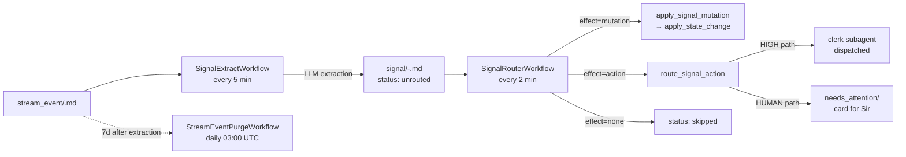

<Note>
Stream events arrive as a torrent — gmail, slack, gcal, omi, vexa, sure, plane, openclaw chats, vault edits. Most of them mean nothing on their own. The signal layer is where Alfred decides which of them mean something to Sir, and what should happen because of them.
</Note>

## What a signal is

A signal is the durable, normalised distillation of a single raw input. Where a stream event is a verbatim record ("an email arrived", "Sir said this on the OMI"), a signal is the conclusion drawn from it: *this is about that task*, *here is the effect*, *here is how confident I am*.

Each signal lives at `vault/signal/<ts>-<hash>.md`. Its frontmatter carries three load-bearing fields:

| Field | Meaning |
|---|---|
| `target_kind` / `target_path` | The matter or task this signal concerns. Resolved by string-similarity ranking against the live vault. `None` when no existing record matches. |
| `effect` | What should happen. One of `mutation` (state change to an existing record), `action` (work needs doing — reply, send, schedule), `none` (informational or noise). |
| `effect_confidence` / `target_confidence` | Two independent confidences. The router uses each on a separate threshold so a clear effect against an ambiguous target still drains, but doesn't fire blindly. |

The signal record also keeps a 200-character `raw_quote` of the originating event (`packages/learn/src/activities/signals.py:209`). That quote survives even after the underlying `stream_event/` record is purged seven days later, so any future re-evaluation has ground truth to look at.

The signal is the durable bridge between observation and action. The stream event is what came in. The signal is what Alfred decided it was. Everything downstream — mutation router, action router, audit, calibration — reads only the signal.

## Why this runs in the background

Sir might reasonably ask why extraction doesn't happen the moment a stream event lands. The answer comes in six parts, all baked into the architecture.

**LLM latency makes synchronous extraction unviable.** Each extraction is a clerk subagent call against `x-ai/grok-4.1-fast` via the openclaw-workers gateway (`packages/learn/src/activities/clerk.py:547`). Healthy calls take 30–60s; tool-using calls take up to 180s. The activity timeout is 300 seconds (`packages/learn/src/workflows/signals.py:186`). No HTTP-facing path can sit on that.

**The trust gradient demands a deferred decision.** Alfred ships into a tenant in shadow mode and earns the right to act through accumulated evidence. A synchronous path — see event, fire mutation — gives nowhere to record decisions you don't yet trust. The signal record is precisely the place those shadow decisions go to live and be audited.

**Restart-safety via the sidecar cursor.** If a worker dies mid-batch, only the events not yet marked in the SQLite sidecar (`packages/learn/src/utils/extraction_index.py:34`) get re-extracted on the next tick. A synchronous path has no such cursor — a crash mid-handler is a lost signal.

**Decoupling ingestion from analysis.** Stream pullers store events at their own cadence; the extractor catches up at its own. Bursty inbox loads or a slow LLM never blocks the puller, and a wedged puller never starves analysis of older work.

**The pre-filter gates LLM cost.** Roughly half of all stream events are dropped without ever hitting the model — newsletters, slash-commands, Composio API errors, stale gcal entries (`packages/learn/src/workflows/signals.py:77`). That cheap gate only exists because the path is deferred. A synchronous path would either pay the LLM cost on every event or duplicate the filter at the puller.

**The reversal calibration loop only makes sense when extraction is deferred.** Confidence priors (`SOURCE_TYPE_CONFIDENCE_PRIORS` in `packages/learn/src/activities/signals.py:240`) are tuned by watching reversals over time; that tuning has nothing to attach to in a single-pass synchronous handler.

## The three workflows



### SignalExtractWorkflow

Source: `packages/learn/src/workflows/signals.py`. Schedule: every 5 minutes, registered as `al-signal-extract` (`packages/learn/scripts/register_schedules.py:90`). Execution timeout 25 minutes (`packages/learn/scripts/register_schedules.py:802`).

Each tick lists up to 100 unprocessed stream events (`BATCH_LIMIT`, `packages/learn/src/workflows/signals.py:78`) and dispatches LLM extraction in chunks of 16 (`EXTRACT_CHUNK_SIZE`, `packages/learn/src/workflows/signals.py:172`). The chunk size sits below the `learn-clerk` agent's `maxChildrenPerAgent=20` cap, leaving four slots of breathing room for cross-tick session leakage. Each chunk is fully written and marked before the next dispatches, so a mid-run timeout never wastes a chunk's worth of LLM calls.

The workflow registration is gated on `STEWARD_SIGNAL_EXTRACT_ENABLED=true`. The check runs at registration time only — re-reading env inside `@workflow.run` would violate Temporal determinism (`packages/learn/src/workflows/signals.py:6`).

### SignalRouterWorkflow

Source: `packages/learn/src/workflows/signal_router.py`. Schedule: every 2 minutes, registered as `al-signal-router` (`packages/learn/scripts/register_schedules.py:102`). Per-tick batch limit 50 (`packages/learn/src/workflows/signal_router.py:85`).

The router lists `vault/signal/*.md` records with `status: unrouted` (oldest-first by `created`) and dispatches per signal:

- `effect: mutation` → `apply_signal_mutation` (`packages/learn/src/activities/signal_mutations.py`), which reuses Steward's existing `apply_state_change` path.
- `effect: action` → `route_signal_action` (`packages/learn/src/activities/signal_actions.py`), which decides between dispatching a clerk subagent (HIGH path) or writing a `needs_attention/` card for Sir (HUMAN path).
- `effect: none` → mark `status: skipped`.

The combined confidence the router actually gates on is `min(target_confidence, effect_confidence)` — the weakest link gates the action (`packages/learn/src/activities/signal_mutations.py:18`).

### StreamEventPurgeWorkflow

Source: `packages/learn/src/workflows/stream_event_purge.py`. Schedule: daily at 03:00 UTC (`packages/learn/scripts/register_schedules.py:914`).

Deletes `stream_event/*.md` records whose `frontmatter.signal_extracted_at` is set AND whose `frontmatter.created` is older than 7 days (`packages/learn/src/workflows/stream_event_purge.py:30`). The signal record persists; the raw stream event was redundant the moment its `raw_quote` was preserved on the signal. Records under `event/` and `conversation/` are not touched.

## The pre-filter

Every clerk call costs tokens, and the bulk of stream traffic is noise. The pre-filter is intentionally aggressive — it runs before any LLM work and accounts for a significant fraction of dropped events (`_pre_filter` at `packages/learn/src/activities/signals.py:552`).

| Check | Behaviour |
|---|---|
| Hard-blocked source types | `HARD_BLOCKED_SOURCE_TYPES = {"slack", "github"}` (`packages/learn/src/activities/signals.py:107`). Both have been observed to be 100% Composio API errors on existing tenants — Sir's slack records were 519 stored API errors, github 340. |
| Garbage shape | Event `name` starting with `{"action"` and containing `"error"` is a Composio API response stored as an event (`packages/learn/src/activities/signals.py:181`). Openclaw slash-command sessions (`/new`, `/status`, `/models`, etc.) match `_OPENCLAW_SLASH_PATTERN` and are dropped (`packages/learn/src/activities/signals.py:114`). |
| Allowlist | Source type must be in `PRE_FILTER_ALLOWLIST = {gmail, slack, omi, openclaw-chat, vexa, sure, gcal, plane, vault_edit}` (`packages/learn/src/activities/signals.py:69`). |
| Body length | `MIN_CONTENT_LENGTH = 20` characters (`packages/learn/src/activities/signals.py:96`). Empty Slack reactions, autofills, stub OMI transcripts get dropped here. |
| Newsletter blocklist | Gmail senders matching `NEWSLETTER_BLOCKLIST` (mailchimp, constantcontact, sendgrid, mailjet, mailerlite) are dropped (`packages/learn/src/activities/signals.py:85`). |
| Stale gcal | gcal events older than `STEWARD_SIGNAL_GCAL_MAX_AGE_DAYS` (default 30) are dropped (`packages/learn/src/activities/signals.py:600`). A meeting from six months ago has nothing to action retroactively. |
| Global age cutoff | Events older than `STEWARD_SIGNAL_MAX_EVENT_AGE_DAYS` (default 14, env-overridable, `0` to disable) are dropped (`packages/learn/src/activities/signals.py:126`). |

<Tip>
Garbage events aren't just dropped — they're bulk-marked into the sidecar so they never appear in a future listing (`packages/learn/src/utils/extraction_index.py:95`). This is the pre-filter's permanent memory: once classified as structural garbage, an event can never spend an LLM call again.
</Tip>

## Per-source confidence priors

A direct openclaw-chat assertion from Sir is much higher signal than an OMI ambient transcript that might be Sir narrating an article aloud. The LLM's `effect_confidence` captures intra-event certainty; the per-source prior captures the prior probability that *this source type even produces real signals*.

The persisted `effect_confidence` is `LLM_confidence × prior`, with the original LLM number stamped as `effect_confidence_raw` for the calibration loop to recover (`packages/learn/src/activities/signals.py:1306`).

| Source type | Prior | Rationale |
|---|---|---|
| `openclaw-chat` | 1.0 | Direct Sir → Alfred — highest trust |
| `gmail` (trusted domain) | 1.0 | Sender domain in `STEWARD_GMAIL_TRUSTED_DOMAINS` |
| `slack` | 0.95 | All of Sir's slack is DM-equivalent today |
| `vault_edit` | 0.95 | Sir's hand-edit — very high trust |
| `sure` | 0.9 | Only after pre-filter |
| `plane` | 0.9 | Project tracker, well-structured |
| `vexa` | 0.85 | Meeting transcript |
| `gcal` | 0.8 | Calendar metadata |
| `gmail_unknown` | 0.7 | Untrusted sender domain |
| `omi` | 0.7 | Ambient audio — lower trust |
| `slack_channel` | 0.6 | Public channels (future-proof; not used yet) |

Each prior is overridable via `STEWARD_SIGNAL_CONFIDENCE_PRIOR_<SOURCE>=<float>` so a tenant can re-weight without a code deploy (`packages/learn/src/activities/signals.py:256`). The reversal calibration loop drops priors over time when Sir undoes an action — see below.

## Auto-task creation

When a signal has `target_kind: null` (no resolvable existing task or matter) AND its `effect` is `action` or `mutation`, the extractor invokes `create_task_from_signal` (`packages/learn/src/activities/task_creation.py:130`). The activity asks an LLM for `{title, description, due_at?, should_create}` and writes a fresh `task/<slug>.md` under `parent_matter: matter/inbox.md` (`packages/learn/src/activities/task_creation.py:103`). The newly created task becomes the signal's resolved target with `target_confidence: 1.0` (`packages/learn/src/activities/signals.py:1296`).

Two safeguards keep this disciplined:

- **Idempotency cache.** `/alfred-data/state/steward/signal-task-creation.json` maps `source_event_path → task_path`. A re-extraction of the same event returns the prior task rather than creating a duplicate (`packages/learn/src/activities/task_creation.py:95`).
- **Env gate.** `STEWARD_SIGNAL_AUTOCREATE_TASKS=true` is required (`packages/learn/src/activities/task_creation.py:122`). Default off; flip on once smoke tests confirm sane title/description pairs.

The LLM has explicit licence to decline — `should_create=false` returns `None` and the signal continues with no target. Sir then sees a needs-disambiguation entry through the action router instead of a phantom task.

## The sidecar SQLite cursor

The extraction cursor lives in `/alfred-data/state/signal_extraction.db`, overridable via `SIGNAL_EXTRACTION_DB_PATH` (`packages/learn/src/utils/extraction_index.py:34`). The schema is two tables (`packages/learn/src/utils/extraction_index.py:42`):

```sql
CREATE TABLE extracted (
  path TEXT PRIMARY KEY,
  extracted_at TEXT NOT NULL,
  signal_path TEXT
);

CREATE TABLE bootstrap (
  id INTEGER PRIMARY KEY CHECK (id = 1),
  completed_at TEXT NOT NULL
);
```

<Warning>
The sidecar replaces an earlier vault-frontmatter cursor that wrote `signal_extracted_at` into each stream event's frontmatter. Sir's gcal backlog contained records with malformed YAML; every mark-attempt routed through `alfred vault edit`, which parsed-edited-rewrote the entire YAML and 500'd on the bad records. A single poisoned event stalled the cursor and re-extracted forever, burning unbounded LLM spend (`packages/learn/src/utils/extraction_index.py:5`).
</Warning>

The SQLite mark is one INSERT — no parse-write cycle, immune to YAML defects. Bootstrap is one-shot: the first tick imports any existing `signal_extracted_at` frontmatter values via `bootstrap_from_records` (`packages/learn/src/utils/extraction_index.py:144`), records completion in the `bootstrap` table, and from there on the sidecar is the source of truth. The `signal_extracted_at` field still gets written into new stream events for read-back diagnostics, but it's never the cursor.

## Mode gating

Three independent env vars control the path. None of them are read inside a workflow body — they're either consumed at registration time or inside individual activities at invocation time, so flipping a flag never breaks Temporal determinism.

<Steps>
  <Step title="STEWARD_SIGNAL_EXTRACT_ENABLED">
    Registration-time gate. Without it, the `al-signal-extract` schedule is never created — extraction simply doesn't happen on this tenant (`packages/learn/scripts/register_schedules.py:782`).
  </Step>
  <Step title="STEWARD_SIGNAL_ROUTER_LIVE_MODE">
    Per-invocation read by `apply_signal_mutation`. Three values: `shadow` (record decisions but don't apply), `live_high_confidence_only` (apply only when confidence clears the high threshold), `live` (apply all). Anything unrecognised falls back to `shadow` — when in doubt, don't act (`packages/learn/src/activities/signal_mutations.py:91`).
  </Step>
  <Step title="STEWARD_SIGNAL_ACTION_LIVE_MODE">
    Same three modes, separate gate for action-class signals (`packages/learn/src/activities/signal_actions.py:85`). The split lets Sir soak the autonomous-dispatch surface in shadow while mutations already run live, or vice versa.
  </Step>
</Steps>

The two `LIVE_MODE` envs are read on every call, not cached. Flipping live ⇄ shadow takes effect on the next tick without a container restart.

## Reversal calibration

Source: `packages/learn/src/activities/calibration_reversal.py`. Schedule: `ReversalCalibrationWorkflow` every 10 minutes (`packages/learn/scripts/register_schedules.py:125`), gated on `STEWARD_REVERSAL_CALIBRATION_ENABLED=true`.

The activity scans two reversal-record globs (`packages/learn/src/activities/calibration_reversal.py:104`):

- `event/steward-action-reversed-*.md` — created when Sir clicks Undo on a Steward audit card.
- `event/signal-action-reversed-*.md` — reserved for the signal-router undo path.

For each new reversal, the contributing source-types are derived from the original action's `signals_summary.sources` (or, as a fallback, from the target task's `signal_sources` block) and each one's confidence is dropped by a flat 0.1 (`packages/learn/src/activities/calibration_reversal.py:564`). Positive feedback (no-undo on a Steward action) flows through the EMA-smoothed `_update_calibration` path. Reversals deliberately bypass the EMA and apply the full -0.1 immediately — fast learning from undo, slow learning from non-undo. The `processed` block in the persistence cache makes the activity idempotent across ticks.

The architectural point is that Alfred listens to "no" louder than to "yes." A single reversal moves the per-source prior more than several quiet successes do. Sir's frustration teaches faster than Sir's silence.

<CardGroup cols={2}>
  <Card title="Semantic layer" icon="brain" href="/architecture/semantic">
    The intuition engine that decides what "routine" looks like — observations, instincts, judgment.
  </Card>
  <Card title="Kinetic layer" icon="gears" href="/architecture/kinetic">
    What happens after the action router fires — the Task Runner and ephemeral subagents.
  </Card>
</CardGroup>
