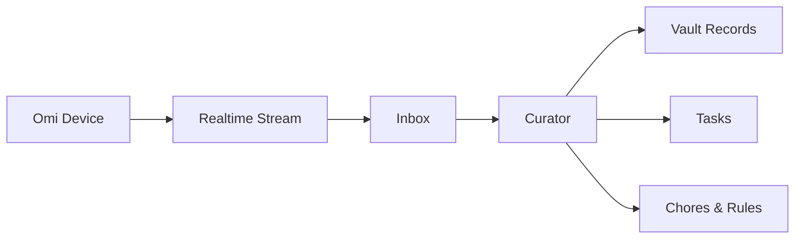

## Always listening, always learning

Ambient Mode connects an [Omi](https://omi.me) wearable device to Alfred. Wear it throughout your day, and every conversation — meetings, phone calls, coffee chats, passing remarks — is captured, transcribed, and processed by Alfred automatically.

You mention "I should call the accountant next week" while having coffee. Alfred hears it. A task appears. No manual entry. No forgotten follow-up.

## How it works

Ambient Mode runs as a realtime Stream, feeding a Temporal pipeline that turns raw audio into structured intelligence.

<Steps>
  <Step title="Recording arrives">
    Your Omi device captures ambient audio and transmits it to Alfred via a persistent WebSocket connection.
  </Step>
  <Step title="Transcript is created">
    The recording is transcribed into text, preserving speaker identification where possible.
  </Step>
  <Step title="Transcript enters the Inbox">
    The transcript arrives in your Inbox as a StreamEvent, tagged with timestamp and source metadata.
  </Step>
  <Step title="The Curator reads and extracts">
    The Curator processes the transcript like any other content — identifying people, projects, decisions, tasks, and commitments mentioned in conversation.
  </Step>
  <Step title="Your vault updates automatically">
    New records are created, existing records are updated, and connections are made across your vault.
  </Step>
</Steps>

## What ambient recordings produce

The Curator doesn't just file transcripts. It reads them for meaning and creates structured output:

| Output type | Example |
|-------------|---------|
| **Tasks** | "I should call the accountant next week" becomes a task with a due date |
| **Vault records** | A new person mentioned in conversation gets a `person` record |
| **Decisions** | "We decided to go with the smaller vendor" becomes a `decision` record |
| **Commitments** | "I'll send you the proposal by Friday" is tracked as a commitment |
| **Entity updates** | Mentioning a known contact updates their `person` record with new context |

Over time, the Distiller reads across these records and surfaces patterns: assumptions your team keeps making, decisions that contradict earlier ones, recurring themes in your conversations.

## Ambient Mode is a source

It's important to understand where Ambient Mode sits in Alfred's architecture. Ambient recordings are a **Stream** — a source of events flowing into Alfred. What Alfred creates from those events are **outputs**: vault records, tasks, chores, rules.

This means Ambient Mode works with every other feature. A conversation captured by your Omi device can trigger a rule, create a task, schedule a chore, or update a vault record — all automatically.

## Setting up Ambient Mode

Ambient Mode is enabled as an integration from your dashboard.

<Steps>
  <Step title="Get an Omi device">
    Order your Omi wearable at [omi.me](https://omi.me). It's a small, lightweight device designed for all-day wear.
  </Step>
  <Step title="Open your dashboard">
    Navigate to [alfred.black/dashboard](https://alfred.black/dashboard) and find the Integrations section.
  </Step>
  <Step title="Enable Ambient Mode">
    Toggle Ambient Mode on and follow the pairing instructions to connect your Omi device to your Alfred instance.
  </Step>
  <Step title="Wear and go">
    Once paired, your Omi device streams audio to Alfred continuously. Transcripts appear in your Inbox within moments of each conversation ending.
  </Step>
</Steps>

### Requirements

| Component | Details |
|-----------|---------|
| **Omi device** | Required — order at [omi.me](https://omi.me) |
| **Alfred instance** | Your Alfred must be running and accessible |
| **Integration toggle** | Enabled from the dashboard Integrations section |

## Privacy and control

Ambient Mode captures everything within range of the Omi device. You control what happens with that data:

- **Pause any time** — Disable the stream from your dashboard to stop processing
- **Your vault, your data** — All recordings and transcripts live in your dedicated Alfred instance
- **Standard security** — All data is encrypted at rest and in transit, processed only by your specialists

<Tip>
  If you're in a conversation you don't want recorded, simply remove the Omi device or pause the Ambient Mode stream from your dashboard.
</Tip>

<Columns cols={2}>
  <Card title="Streams" icon="wave-pulse" href="/features/streams">
    How Ambient Mode fits into Alfred's data pipeline architecture
  </Card>
  <Card title="Alfred Talk" icon="phone" href="/features/talk-mode">
    Give Alfred a voice for calls and briefings
  </Card>
</Columns>
