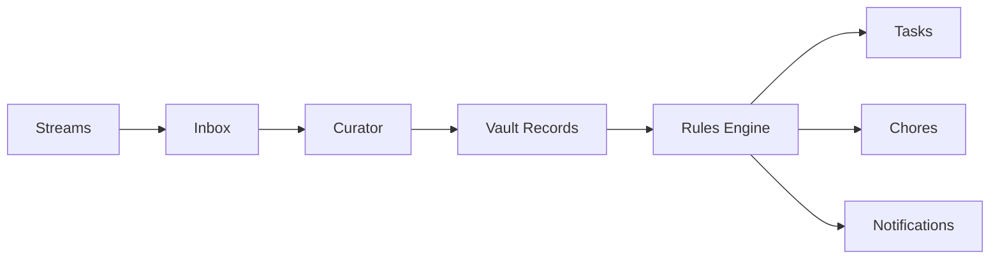

<Note>
Part of Alfred's **[Kinetic Layer](/architecture/kinetic)** — the layer that turns knowledge into action through durable workflows.
</Note>

## Alfred acts, not just remembers

Your vault holds what Alfred knows. But knowledge without action is just a filing cabinet. Tasks, Chores, and Rules are how Alfred turns understanding into execution — handling the things that need doing so you don't have to.

<Note>
  Tasks, Chores, and Rules are coming soon. This page describes how they'll work when they arrive.
</Note>

## Tasks

Tasks are one-off action items Alfred creates, tracks, and executes on your behalf.

Every task is structured around four questions:

| Question | What it defines |
|----------|----------------|
| **What** | The specific action to be taken |
| **When** | The deadline or trigger condition |
| **How** | The method — a call, an email, a lookup, a reminder |
| **Why** | The context that prompted this task |

### Where tasks come from

Tasks aren't just things you assign manually. Alfred identifies them everywhere:

- **Conversations** — "I should call the accountant next week" becomes a task automatically
- **Emails** — An invoice with a due date generates a payment reminder task
- **Ambient recordings** — A passing mention at coffee becomes a follow-up
- **Your dashboard** — Create tasks directly when you know what needs doing
- **The API** — Programmatic task creation for your own integrations

### Task lifecycle

Alfred doesn't just create tasks and leave them on a list. Each task is tracked through completion — with reminders, status updates, and execution handled by Alfred where possible.

<Warning>
  Coming Soon — Tasks are in active development. Watch this space.
</Warning>

---

## Chores

Chores are recurring scheduled jobs Alfred runs automatically on a cadence you define.

Think of them as standing instructions: things that need doing regularly, handled without you lifting a finger.

### Examples

| Chore | Schedule | Delivery |
|-------|----------|----------|
| **Daily Briefing** | Every morning at 7am | SMS, email, or voice call |
| **Weekly Grocery List** | Every Sunday at 10am | SMS or email |
| **Monthly Expense Report** | First of each month | Email with attachment |

### How chores run

Each chore is backed by a Temporal workflow running on a cron schedule. When the schedule fires, Alfred assembles the output — pulling from your vault, checking external sources, applying your preferences — and delivers the result through your preferred channel.

Delivery channels include:

- **SMS** — Short summaries and reminders
- **Email** — Longer reports and documents
- **Slack** — Team-facing updates
- **Voice call** — Briefings via Alfred Talk Mode

<Warning>
  Coming Soon — Chores are in active development. Watch this space.
</Warning>

---

## Rules

Rules are if/then automation logic defined in natural language. Tell Alfred what to watch for and what to do about it — Alfred handles the rest.

### Examples

> "For each meeting that requires travel, check traffic two hours beforehand and call me if I need to leave early."

> "When an invoice arrives by email, extract the amount and due date, then create a task three days before it's due."

> "If anyone mentions a new competitor in a meeting, create a record and notify me."

### How rules work

Rules are evaluated continuously against two sources:

- **Incoming stream events** — New emails, calendar events, ambient recordings, webhooks
- **Vault changes** — New or updated records created by your specialists

When a rule's condition matches, Alfred executes the defined action — creating a task, sending a notification, updating a record, or triggering a chore.

Rules bridge the gap between passive knowledge and proactive service. Your vault stores what's true. Rules define what to do about it.

<Warning>
  Coming Soon — Rules are in active development. Watch this space.
</Warning>

---

## How it all connects

Streams bring events in. The Curator structures them. Tasks, Chores, and Rules act on them.

A single ambient recording can generate a vault record, trigger a rule, create a task, and schedule a chore — all without you doing anything beyond having the conversation.

<Columns cols={2}>
  <Card title="Streams" icon="wave-pulse" href="/features/streams">
    How events flow into Alfred from the outside world
  </Card>
  <Card title="Ambient Mode" icon="microphone" href="/features/ambient-mode">
    Continuous listening that feeds Streams, Tasks, and more
  </Card>
</Columns>
