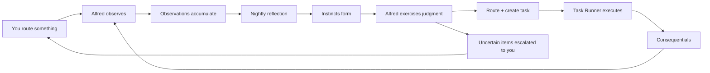

## Overview

Alfred doesn't just organize — over time, it learns. As you route inputs, make decisions, and organize your vault, Alfred quietly observes your preferences. Those observations become instincts — learned patterns that let Alfred handle routine decisions on your behalf, so you only need to weigh in on what truly requires your judgment.

This is Alfred's **intuition** — the accumulated understanding of how your world works.

## How intuition develops

Alfred's intuition develops through a natural cycle:



### 1. Observation — watching how you work

Every time you route an input, categorize something, or make an organizational decision, Alfred takes note. These notes are called **observations** — records of what you did and why it made sense.

Alfred doesn't guess. It watches. Observations come from three sources:

- **Stream events** — events from Gmail, Notion, Omi, and other integrations are classified by the Event Processor and fed into the observation pipeline automatically
- **Your conversations** — when you tell Alfred to file something under a project, route an email to a category, or organize an input, the routing decision is captured automatically
- **Your explicit instructions** — you can add an `alfred_instructions` field to any vault record to teach Alfred directly

<Tip>
  You don't need to do anything special for Alfred to learn. Just use Alfred as you normally would — routing and organizing your inputs — and observations accumulate naturally.
</Tip>

### 2. Reflection — distilling patterns from experience

Every night at 2am, Alfred reviews the day's observations against its existing instincts. This is **reflection** — the process of turning individual observations into general patterns.

During reflection, Alfred may:

- **Create** a new instinct when it sees the same pattern in at least 3 observations
- **Strengthen** an existing instinct with new supporting evidence
- **Merge** two instincts that have converged
- **Deprecate** an instinct that new evidence contradicts

Each reflection produces a report stored in your vault — a record of what Alfred learned and why.

### 3. Judgment — knowing when to act

Once instincts exist, Alfred can exercise **judgment** on new inputs. When something arrives, Alfred scores it against its instincts and decides: handle it, or ask you?

This is where **discretion** comes in — a good butler's most important quality. Alfred knows when to act and when to defer.

| Experience | Discretion | What Alfred does |
|-----------|-----------|-----------------|
| Fewer than 10 observations | Very cautious | "I've barely seen this before, sir. Your guidance?" — `requires_approval` forced on any tasks |
| 10-19 observations | Cautious | "I believe I know, but I'd rather confirm." |
| 20-49 observations | Moderate | "I'm fairly certain this goes here." |
| 50+ observations, score > 0.75 | Confident | "This is routine." — tasks may auto-execute without approval |

Alfred starts by asking about everything. As observations accumulate and instincts form, it gradually handles more on its own — but always errs on the side of asking when uncertain.

### 4. From intuition to action

Instincts don't just route — they can **execute**. When an instinct includes an execution block, Judgment does two things at once: routes the input to the Curator for record creation *and* creates a task for the Task Runner to carry out.

The execution block on an instinct specifies:
- **tier** — how much power the task gets (1 = read-only, 2 = read-write, 3 = full)
- **skill_entry** — which methodology to follow
- **budget_turns** — how many turns the agent gets
- **requires_approval** — whether you need to approve before execution begins

<Note>
  New instincts (fewer than 10 observations) always force `requires_approval=true` on their tasks, regardless of the execution block's setting. Alfred won't act autonomously until it has enough experience to be confident. This is the **discretion gate**.
</Note>

The Task Runner picks up the task, assembles context (the skill methodology, the related matter, relevant observations), and executes via `sessions_spawn`. When it finishes, it writes a ledger entry and handles any consequentials — follow-up errands that flow naturally from the completed work.

Tasks are organized around **Matters** (ongoing concerns) and executed as **Errands** (discrete units of work). Items the system can't confidently classify are routed to **Triage** for your review — and your triage decisions feed back into the observation pipeline, teaching Alfred for next time.

This closes the loop from observation to action: you teach Alfred by routing, Alfred learns through reflection, and eventually Alfred both routes *and* acts — with appropriate caution.

## The cold start

When your Alfred is new, its intuition is empty. No observations, no instincts, no autonomous routing.

**Everything escalates to you.** This is by design.

As you work with Alfred — routing inputs, organizing content, making decisions — observations accumulate naturally. After enough observations of the same pattern (at least 3), reflection creates your first instincts. Judgment begins routing the obvious cases. Over days and weeks, Alfred becomes increasingly capable of handling routine decisions without your input.

You don't need to configure anything. Just use Alfred, and intuition develops on its own.

## Sessions

Alfred automatically groups related vault activity into **sessions** — time-bounded periods that represent a focused block of work or conversation.

Session boundaries are detected by time:

- Records within **30 minutes** of each other belong to the same session
- Records more than **2 hours** apart are always different sessions
- Records **30 minutes to 2 hours** apart are evaluated for topical continuity

Sessions help you see your work in context — not as isolated records, but as coherent episodes of activity.

## Daily digest

Every evening at 6pm, Alfred prepares a **daily digest** — a summary of what happened today. The digest includes:

- Records created and updated
- Sessions detected
- Decisions made
- Items still awaiting your attention

The digest is written to your vault as an event record, giving you a natural checkpoint to review the day.

## Checking on intuition

### From the dashboard

Go to your [Alfred Black dashboard](https://alfred.black) and navigate to the **Intuition** page. You'll see:

- **Status bar** — processed events today, observation count, active instincts, and auto-route rate
- **Awaiting Judgment** — inputs that need your routing decision, with the best instinct match shown for context
- **Instincts** — your active and developing instincts with observation counts and discretion levels
- **Activity feed** — recent processing, routing, and reflection events

### Via the API

<CodeGroup>
```bash Check intuition status
curl -s /api/v1/learning/status \
  -H "Authorization: Bearer alf_your_key_here" | jq .
```

```bash List active instincts
curl -s /api/v1/learning/instincts \
  -H "Authorization: Bearer alf_your_key_here" | jq .
```

```bash View items awaiting judgment
curl -s /api/v1/learning/queue \
  -H "Authorization: Bearer alf_your_key_here" | jq .
```

```bash Route an input manually
curl -X POST /api/v1/learning/route \
  -H "Authorization: Bearer alf_your_key_here" \
  -H "Content-Type: application/json" \
  -d '{"input_id": "event-abc123", "destination": "project/client-onboarding"}'
```
</CodeGroup>

### View reflection history

See what Alfred learned during its nightly reflections:

```bash
curl -s /api/v1/learning/reflections \
  -H "Authorization: Bearer alf_your_key_here" | jq .
```

## The background processes

Intuition runs on seven automated processes. You don't need to manage them — they run on schedules and take care of themselves.

| Process | Schedule | What it does |
|---------|----------|-------------|
| **Event Processor** | Every 2 minutes | Reads incoming stream events from Gmail, Notion, Omi, and other integrations, classifies them, and writes vault records |
| **Session Tracker** | Every 5 minutes | Groups related records into sessions |
| **Daily Digest** | Daily at 6pm | Summarizes the day's activity |
| **Learning** | Every 5 minutes | Captures observations from your routing decisions |
| **Reflection** | Daily at 2am | Reviews observations and refines instincts |
| **Judgment** | Every 2 minutes | Routes inputs using instincts, escalates uncertain ones to you |
| **Task Runner** | Every 2 minutes | Picks up queued tasks (Matters and Errands), follows skill methodologies, executes work, writes ledger entries, and creates consequential follow-up errands |

All seven processes are managed by the Temporal Engine and can be monitored from the Workflows section of your dashboard.

## Teaching Alfred directly

Beyond routing inputs through conversation, you can teach Alfred explicitly by adding an `alfred_instructions` field to any vault record:

```yaml
---
type: input
name: Vendor Invoice March
alfred_instructions: "This is a recurring vendor invoice — route to process/invoice-processing"
---
```

Alfred picks up the instruction, creates an observation, and executes the routing. This is useful when you want to establish a pattern quickly or give Alfred a direct instruction to act on.

## Enabling and disabling

Intuition is enabled by default. If you'd prefer Alfred to work without learning your preferences:

<CodeGroup>
```bash Disable intuition
curl -X POST /api/v1/learning/disable \
  -H "Authorization: Bearer alf_your_key_here"
```

```bash Re-enable intuition
curl -X POST /api/v1/learning/enable \
  -H "Authorization: Bearer alf_your_key_here"
```
</CodeGroup>

Disabling pauses all seven processes but preserves your existing observations and instincts. Re-enabling picks up where Alfred left off.

## Troubleshooting

**Alfred isn't learning from my routing decisions?**
1. Check that intuition is enabled: `GET /api/v1/learning/status`
2. Observations are captured from conversations — make sure you're routing inputs through Alfred (not editing vault files directly)
3. Check the observation count — new instincts require at least 3 observations of the same pattern

**Inputs aren't being auto-routed?**
1. Check whether any instincts exist: `GET /api/v1/learning/instincts`
2. New instincts start with high discretion thresholds — Alfred needs confidence before acting autonomously
3. Continue routing inputs manually — each routing decision strengthens Alfred's instincts

**Want to see what Alfred reflected on?**
```bash
curl -s /api/v1/learning/reflections \
  -H "Authorization: Bearer alf_your_key_here" | jq .
```

**Quarantined events?**

Events that fail processing twice are quarantined. View and manage them:

<CodeGroup>
```bash View quarantined events
curl -s /api/v1/learning/quarantine \
  -H "Authorization: Bearer alf_your_key_here" | jq .
```

```bash Retry a quarantined event
curl -X POST /api/v1/learning/quarantine/EVENT_ID/retry \
  -H "Authorization: Bearer alf_your_key_here"
```

```bash Dismiss a quarantined event
curl -X POST /api/v1/learning/quarantine/EVENT_ID/dismiss \
  -H "Authorization: Bearer alf_your_key_here"
```
</CodeGroup>

<Columns cols={2}>
  <Card title="Record Types" icon="shapes" href="/vault/record-types">
    See observation, instinct, and reflection record types
  </Card>
  <Card title="Your Specialists" icon="gears" href="/guides/your-ai-agents">
    Monitor and direct your specialists
  </Card>
</Columns>
