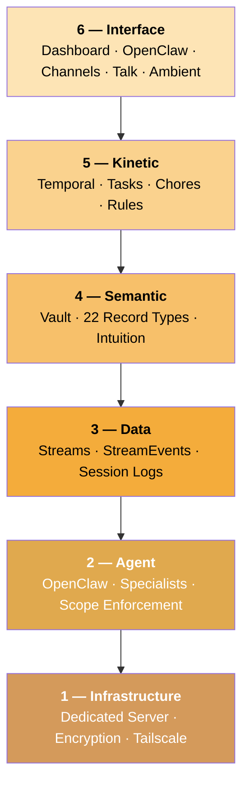

Alfred Black is a full-stack private intelligence service. Every subscriber gets a dedicated machine — no shared infrastructure, no multi-tenant databases, no commingled data. The entire system is organized in six layers, each with a clear responsibility.

---

## Layer 1 — Infrastructure

**Your dedicated machine.**

Every Alfred subscriber gets their own Hetzner Cloud server (cx53: 8 vCPU, 32GB RAM). Your data is encrypted at rest with LUKS2 (AES-256-XTS). All services bind to localhost — zero public ports. External access is exclusively through your private Tailscale mesh network, which provides end-to-end WireGuard encryption.

No shared infrastructure between subscribers. Your data never touches another subscriber's machine.

<Card title="Infrastructure deep dive" icon="server" href="/architecture/infrastructure">
  Dedicated servers, encryption, network isolation, container hardening, and data lifecycle.
</Card>

---

## Layer 2 — Agent

**Your team of specialists.**

OpenClaw is the AI agent runtime. It hosts four specialist workers — Curator, Janitor, Distiller, and Surveyor — each with strictly enforced scope permissions. Agents interact with your vault only through the `alfred vault` CLI gate; they never touch the filesystem directly.

| Specialist | Role | When they work |
|-----------|------|------|
| **Curator** | Reads what you share and creates structured vault records | Automatically when new content arrives |
| **Janitor** | Scans for and repairs structural issues in your vault | Periodic sweeps |
| **Distiller** | Surfaces assumptions, decisions, constraints, and insights | On-demand or scheduled |
| **Surveyor** | Embeds records, clusters by meaning, discovers relationships | On-demand or scheduled |

<Card title="Agent deep dive" icon="robot" href="/architecture/agent">
  OpenClaw runtime, specialist roles, scope enforcement, and prompt injection defense.
</Card>

---

## Layer 3 — Data

**Your world, flowing in.**

You don't have to hand everything to Alfred manually. [Streams](/features/streams) are data pipelines that capture events from external sources — your email, calendar, payment providers, and ambient recording devices — and deliver them to Alfred's Inbox automatically. Every event arrives in a standard StreamEvent envelope. The Curator processes each one, creating and updating vault records just as if you'd shared the content yourself.

Alfred also comes with a default stream: **OpenClaw Session Logs**, which captures every conversation you have with Alfred and processes it for decisions, entities, tasks, and patterns.

<Card title="Data deep dive" icon="wave-pulse" href="/architecture/data">
  Stream types, the StreamEvent envelope, and how events flow into your vault.
</Card>

---

## Layer 4 — Semantic

**Your structured knowledge.**

The vault is an Obsidian-compatible collection of Markdown files with YAML frontmatter. Alfred manages 22 record types organized into four layers: standing entities (person, org, project, etc.), activity records (conversation, task, event, etc.), learning types (assumption, decision, constraint, contradiction, synthesis), and intuition types (observation, instinct, reflection).

Records connect through wikilinks, forming a growing knowledge graph. Over time, Alfred develops **intuition** — the accumulated understanding of your preferences. Observations of how you route inputs are refined into instincts during nightly reflection, letting Alfred handle routine decisions on your behalf.

<Card title="Semantic deep dive" icon="brain" href="/architecture/semantic">
  Vault structure, record types, relationships, and the learning cycle.
</Card>

---

## Layer 5 — Kinetic

**Your actions in motion.**

Temporal is the workflow orchestration engine. It manages durable workflows with automatic retries, cron schedules, and signal handling. Workers run as Temporal activities — the Curator's inbox processing, the Janitor's periodic sweeps, the Distiller's knowledge extraction, and Alfred's six intuition processes are all orchestrated as Temporal workflows.

Beyond the specialists, Tasks, Chores, and Rules (coming soon) will turn vault knowledge into proactive action: one-off tasks created from conversations, recurring chores delivered on schedule, and if/then rules that respond to incoming events.

<Card title="Kinetic deep dive" icon="gears" href="/architecture/kinetic">
  Temporal engine, workflow orchestration, schedules, and the path from knowledge to action.
</Card>

---

## Layer 6 — Interface

**Your points of contact.**

Every way you interact with Alfred — the dashboard at alfred.black, the OpenClaw TUI via SSH, channels like WhatsApp and iMessage and Telegram and Discord, voice calls via Alfred Talk, continuous listening via Ambient Mode, and email (coming soon). Every interface feeds into the same pipeline: content arrives, specialists process it, your vault grows.

<Card title="Interface deep dive" icon="display" href="/architecture/interface">
  Dashboard, OpenClaw, channels, Talk Mode, Ambient Mode, and device pairing.
</Card>

---

## Always working

Alfred doesn't wait for you to ask. Background processes run continuously:

| Process | Frequency | Layer |
|---------|-----------|-------|
| Curator attends to inbox | Seconds after arrival | Agent |
| Janitor health scans | Periodic sweeps | Agent |
| Distiller knowledge extraction | On-demand + scheduled | Agent |
| Surveyor clustering | On-demand + scheduled | Agent |
| Event processing | Every 2 minutes | Kinetic |
| Session tracking | Every 5 minutes | Kinetic |
| Daily digest | Daily at 6pm | Kinetic |
| Learning from routing | Every 5 minutes | Kinetic |
| Nightly reflection | Daily at 2am | Kinetic |
| Judgment and routing | Every 2 minutes | Kinetic |
| Health monitoring | Every 2 minutes | Infrastructure |
| Encrypted backups | Daily at 3am | Infrastructure |

You can check on your specialists, trigger a run, and view their history from your dashboard or via the API.

---

## Explore each layer

<Columns cols={3}>
  <Card title="Infrastructure" icon="server" href="/architecture/infrastructure">
    Dedicated servers, encryption, network isolation
  </Card>
  <Card title="Agent" icon="robot" href="/architecture/agent">
    OpenClaw runtime, specialists, scope enforcement
  </Card>
  <Card title="Data" icon="wave-pulse" href="/architecture/data">
    Streams, events, session logs
  </Card>
  <Card title="Semantic" icon="brain" href="/architecture/semantic">
    Vault, record types, intuition
  </Card>
  <Card title="Kinetic" icon="gears" href="/architecture/kinetic">
    Temporal, workflows, schedules
  </Card>
  <Card title="Interface" icon="display" href="/architecture/interface">
    Dashboard, channels, Talk, Ambient
  </Card>
</Columns>
