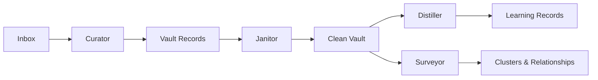

## The pipeline

When you drop content into Alfred's inbox, it flows through a pipeline of AI agents that extract, structure, and connect knowledge automatically.

## What each agent does

### Curator — processes your inbox

The Curator watches for new content in your inbox. When something arrives, it reads the raw text and creates structured records: people, projects, tasks, decisions, and more. Each record is linked to every other relevant record.

**Example:** You drop in meeting notes mentioning "Alice from Acme discussed the Q1 launch timeline." The Curator creates a `person` record for Alice, links it to an `org` record for Acme and a `project` record for Q1 Launch, and creates the `conversation` record for the meeting itself.

### Janitor — maintains vault health

The Janitor periodically scans your entire vault looking for structural problems: broken links between records, missing metadata, orphaned records with no connections. When it finds issues, it fixes them automatically.

### Distiller — extracts deeper knowledge

The Distiller reads your operational records and surfaces the knowledge hiding between the lines: assumptions your team is making, decisions that were taken (and why), constraints you're operating under, contradictions across different sources, and synthesized insights that connect multiple records.

### Surveyor — maps your knowledge graph

The Surveyor takes a different approach from the other agents. Instead of using an AI agent backend, it runs its own 4-stage pipeline: **Embed** (vectorize vault records), **Cluster** (group semantically similar records), **Label** (name the clusters using an LLM), and **Write** (add cluster tags and relationship links back to your vault). The result is a bird's-eye view of how your knowledge connects.

## Record types

Alfred manages 19 types of records organized into three categories:

### Standing entities — the who and what

These represent the stable elements of your world:

| Type | What it represents |
|------|-------------------|
| `person` | People and contacts |
| `org` | Organizations and companies |
| `project` | Projects and initiatives |
| `location` | Physical or virtual locations |
| `account` | Accounts and subscriptions |
| `asset` | Physical or digital resources |
| `process` | Defined processes and workflows |

### Activity records — what happened

These capture events, work, and interactions:

| Type | What it represents |
|------|-------------------|
| `conversation` | Meetings, discussions, dialogue |
| `note` | Observations and freeform content |
| `task` | Action items and todos |
| `event` | One-time occurrences |
| `session` | Time-bounded work periods |
| `input` | Incoming items being processed |
| `run` | Execution runs and batch operations |

### Learning records — what we know

These are created by the Distiller from your operational records:

| Type | What it represents |
|------|-------------------|
| `assumption` | Implicit assumptions found in your records |
| `decision` | Choices made, with rationale |
| `constraint` | Limitations and boundaries |
| `contradiction` | Conflicts between different records |
| `synthesis` | Insights connecting multiple records |

## How records connect

Every record can reference other records. When the Curator creates a person mentioned in a conversation, both records automatically link to each other. Over time, these connections build a rich knowledge graph.

**Example flow:** You drop in notes from a planning meeting:

1. The **Curator** creates records: 3 people, 1 project, 2 tasks, 1 decision, and the conversation itself
2. All records are cross-linked: people → conversation, tasks → project, decision → conversation
3. The **Janitor** verifies all links are valid and metadata is consistent
4. The **Distiller** later identifies an assumption ("we're assuming the API will be ready by March") and a constraint ("budget is capped at $50k") — both linked back to the source records
5. The **Surveyor** clusters these new records with existing ones, revealing that this meeting's topics overlap with three other recent discussions

Your vault grows richer with every piece of content you feed it.

## Continuous operation

Your agents run continuously in the background:

- **Curator** processes new inbox items within seconds of arrival
- **Janitor** runs periodic health scans automatically
- **Distiller** can be triggered on-demand or scheduled
- **Surveyor** can be triggered on-demand or scheduled to re-cluster and discover new relationships

You can monitor agent status, trigger manual runs, and view processing history from your dashboard or via the API.

<Columns cols={2}>
  <Card title="Your Vault" icon="vault" href="/vault/understanding-your-vault">
    Dive deeper into how your vault works
  </Card>
  <Card title="Your AI Agents" icon="gears" href="/guides/your-ai-agents">
    Learn to control your agents
  </Card>
</Columns>
