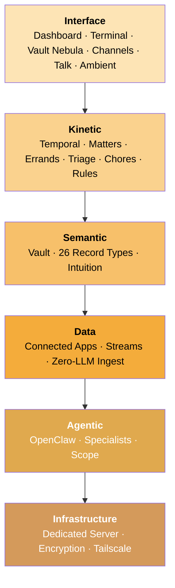

Alfred Black is a full-stack private intelligence service. Every subscriber gets a dedicated machine — no shared infrastructure, no multi-tenant databases, no commingled data. The entire system is organized in six layers, each with a clear responsibility.

---

## Infrastructure Layer

**Your dedicated machine.**

Every subscriber gets their own Hetzner Cloud server. Data encrypted at rest with LUKS2. All services bind to localhost — zero public ports. External access exclusively through your private Tailscale mesh. No shared infrastructure between subscribers. Your data never touches another subscriber's machine.

<Card title="Infrastructure Layer" icon="server" href="/architecture/infrastructure">
  Dedicated servers, encryption, network isolation, container hardening, and data lifecycle.
</Card>

## Agentic Layer

**Your team of specialists.**

OpenClaw hosts five specialist workers — Curator, Janitor, Distiller, Surveyor, and Clerk — each with strictly enforced scope permissions. They interact with your vault only through a controlled CLI gate; they never touch the filesystem directly.

| Specialist | What they do | When they work |
|-----------|-------------|------|
| **Curator** | Reads what you share and creates structured vault records | Automatically when new content arrives |
| **Janitor** | Scans for and repairs structural issues in your vault | Periodic sweeps |
| **Distiller** | Surfaces assumptions, decisions, constraints, and insights | On-demand or scheduled |
| **Surveyor** | Embeds records, clusters by meaning, discovers relationships | On-demand or scheduled |
| **Clerk** | Stateless LLM worker dispatched for analytical tasks — classification, extraction, summarization | On-demand by other specialists |

<Card title="Agentic Layer" icon="robot" href="/architecture/agent">
  OpenClaw runtime, specialist roles, scope enforcement, and prompt injection defense.
</Card>

## Data Layer

**Your world, flowing in.**

Connect over 1,000 apps via Composio — Gmail, Google Calendar, Notion, GitHub, Slack, and more. Each connection creates a persistent OAuth link that never expires. Alfred polls for new data on a schedule, creates structured vault records using zero-LLM Python templates, and enriches them in hourly batches. Incremental sync means only new or changed items are fetched — not the entire dataset every time.

<Card title="Data Layer" icon="wave-pulse" href="/architecture/data">
  Connected Apps, Composio integration, zero-LLM ingest, incremental sync, and stream management.
</Card>

## Semantic Layer

**Your structured knowledge.**

The vault is an Obsidian-compatible collection of Markdown files. Alfred manages 26 record types across four layers: standing entities, activity records, learning types, and intuition types. Records connect through wikilinks, forming a growing knowledge graph. Over time, Alfred develops **intuition** — learned patterns that let it handle routine decisions on your behalf.

<Card title="Semantic Layer" icon="brain" href="/architecture/semantic">
  Vault structure, record types, relationships, and the learning cycle.
</Card>

## Kinetic Layer

**Your actions in motion.**

Temporal is the workflow engine. It orchestrates every specialist, intuition process, and action Alfred takes. The Kinetic layer is built around four core concepts: **Matters** (standing concerns that group related work), **Errands** (actionable tasks with a status lifecycle), **Chores** (recurring scheduled workflows generated by Opus, personalised per tenant), and **Triage** (items flagged for your review). Together with the progressive autonomy pipeline — where Alfred learns instincts from your instructions and executes them via ephemeral agents on connected apps — they turn vault knowledge into proactive service.

<Card title="Kinetic Layer" icon="gears" href="/architecture/kinetic">
  Temporal engine, Matters, Errands, Chores, Triage, progressive autonomy, and background processes.
</Card>

## Interface Layer

**Your points of contact.**

Every way you interact with Alfred — the dashboard, **Vault Nebula** (a 3D visualization of your knowledge graph), a **Terminal proxy** with full PTY support for direct CLI access to OpenClaw, messaging channels (WhatsApp, iMessage, Telegram, Discord), voice calls via Talk Mode, continuous listening via Ambient Mode, and the REST API. Every interface feeds into the same pipeline.

<Card title="Interface Layer" icon="display" href="/architecture/interface">
  Dashboard, terminal, channels, Talk Mode, Ambient Mode, device pairing, and the API.
</Card>

---

## Always working

Alfred doesn't wait for you to ask. Your specialists and intuition processes run continuously in the background:

- **Curator** attends to new inbox items within seconds of arrival — whether shared manually or delivered by a Stream
- **Janitor** runs periodic health scans automatically
- **Distiller** and **Surveyor** can be triggered on-demand or scheduled
- **Intuition** observes, learns, and routes on automated schedules — no intervention needed

You can check on your specialists, trigger a run, and view their history from your dashboard or via the API.

<Columns cols={3}>
  <Card title="Infrastructure" icon="server" href="/architecture/infrastructure">
    Dedicated servers, encryption, network isolation
  </Card>
  <Card title="Agentic" icon="robot" href="/architecture/agent">
    OpenClaw, specialists, scope enforcement
  </Card>
  <Card title="Data" icon="wave-pulse" href="/architecture/data">
    Streams, events, session logs
  </Card>
  <Card title="Semantic" icon="brain" href="/architecture/semantic">
    Vault, record types, intuition
  </Card>
  <Card title="Kinetic" icon="gears" href="/architecture/kinetic">
    Temporal, Matters, Errands, Triage, Chores, Rules
  </Card>
  <Card title="Interface" icon="display" href="/architecture/interface">
    Dashboard, Vault Nebula, Terminal, Channels, Talk, Ambient
  </Card>
</Columns>
