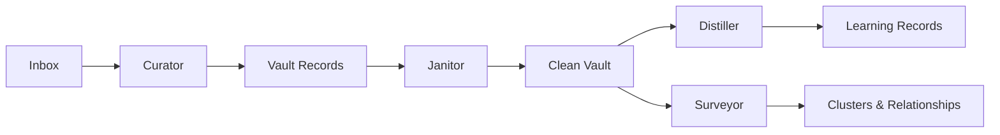

## Behind the scenes

When you hand something to Alfred — a meeting note, a conversation, a rough idea — a team of specialists takes over. Each one reads, structures, verifies, and connects your content until what started as raw text becomes part of a living, interconnected vault.

## Your specialists

### Curator — reads what you share

The Curator watches for new content. When something arrives, it reads the raw text and creates structured records: people, projects, tasks, decisions, and more. Each record is linked to every other relevant record.

**Example:** You share meeting notes mentioning "Alice from Acme discussed the Q1 launch timeline." The Curator creates a `person` record for Alice, links it to an `org` record for Acme and a `project` record for Q1 Launch, and creates the `conversation` record for the meeting itself.

### Janitor — keeps your vault in order

The Janitor periodically walks through your entire vault looking for structural problems: broken links between records, missing metadata, orphaned records with no connections. When it finds issues, it repairs them quietly.

### Distiller — surfaces what's hidden

The Distiller reads your records and finds the knowledge hiding between the lines: assumptions your team is making, decisions that were taken (and why), constraints you're operating under, contradictions across different sources, and synthesized insights that connect multiple records.

### Surveyor — maps your connected world

The Surveyor takes a different approach. Instead of reading individual records, it works across your entire vault: **Embed** (represent each record as a vector), **Cluster** (group records by meaning), **Label** (name the clusters), and **Write** (add cluster tags and relationship links back to your vault). The result is a bird's-eye view of how everything connects.

## Record types

Alfred manages 19 types of records organized into three layers:

### The who and what — Standing entities

The stable elements of your world:

| Type | What it represents |
|------|-------------------|
| `person` | People and contacts |
| `org` | Organizations and companies |
| `project` | Projects and initiatives |
| `location` | Physical or virtual locations |
| `account` | Accounts and subscriptions |
| `asset` | Physical or digital resources |
| `process` | Defined processes and workflows |

### What happened — Activity records

Events, work, and interactions:

| Type | What it represents |
|------|-------------------|
| `conversation` | Meetings, discussions, dialogue |
| `note` | Observations and freeform content |
| `task` | Action items and todos |
| `event` | One-time occurrences |
| `session` | Time-bounded work periods |
| `input` | Incoming items being attended to |
| `run` | Execution runs and batch operations |

### What we know — Learning records

Created by the Distiller from your records:

| Type | What it represents |
|------|-------------------|
| `assumption` | Implicit assumptions found in your records |
| `decision` | Choices made, with rationale |
| `constraint` | Limitations and boundaries |
| `contradiction` | Conflicts between different records |
| `synthesis` | Insights connecting multiple records |

## How records connect

Every record can reference other records. When the Curator creates a person mentioned in a conversation, both records automatically link to each other. Over time, these connections build a rich, navigable map of your world.

**Example:** You share notes from a planning meeting:

1. The **Curator** creates records: 3 people, 1 project, 2 tasks, 1 decision, and the conversation itself
2. All records are cross-linked: people to conversation, tasks to project, decision to conversation
3. The **Janitor** verifies all links are valid and metadata is consistent
4. The **Distiller** later surfaces an assumption ("we're assuming the API will be ready by March") and a constraint ("budget is capped at $50k") — both linked back to the source records
5. The **Surveyor** clusters these records with existing ones, revealing that this meeting's topics overlap with three other recent discussions

Your vault grows richer with everything you share.

## Always working

Your specialists run continuously in the background:

- **Curator** attends to new inbox items within seconds of arrival
- **Janitor** runs periodic health scans automatically
- **Distiller** can be triggered on-demand or scheduled
- **Surveyor** can be triggered on-demand or scheduled to re-cluster and discover new relationships

You can check on your specialists, trigger a run, and view their history from your dashboard or via the API.

<Columns cols={2}>
  <Card title="Your Vault" icon="vault" href="/vault/understanding-your-vault">
    Understand how your vault works
  </Card>
  <Card title="Your Specialists" icon="gears" href="/guides/your-ai-agents">
    Monitor and direct your specialists
  </Card>
</Columns>
