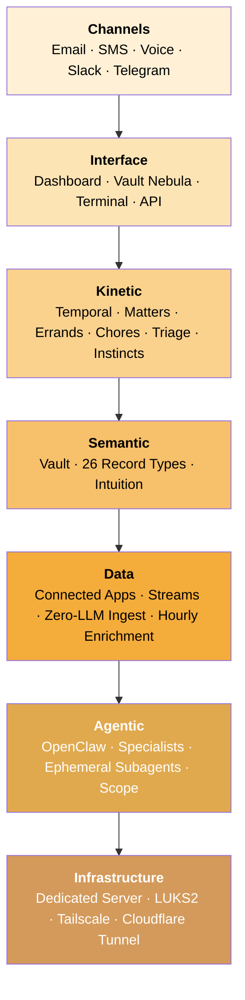

Alfred Black is a full-stack private intelligence service. Every subscriber gets their own dedicated machine — no shared databases, no commingled vaults, no multi-tenant tables. The system is organised in seven layers, each with a single responsibility.

---

## Infrastructure Layer

**Sir's dedicated machine.**

Every subscriber is given their own Hetzner Cloud server. Disk encrypted at rest with LUKS2. All services bind to localhost — there are no public ports. External access exists only via Sir's private Tailscale mesh, with a Cloudflare Tunnel relaying the SaaS proxy. Sir's data never sits on shared infrastructure.

<Card title="Infrastructure Layer" icon="server" href="/architecture/infrastructure">
  Dedicated servers, encryption, network isolation, container hardening.
</Card>

## Agentic Layer

**Sir's staff of specialists.**

The OpenClaw gateway hosts the specialist workers — Curator, Janitor, Distiller, Surveyor, and the Clerk — each with strictly enforced scope permissions. They reach the vault only through the controlled `ctrl-api` endpoint; they never touch the filesystem directly. The Kinetic layer can also spin up **ephemeral subagents** with per-task tool scoping for one-off execution.

<Card title="Agentic Layer" icon="robot" href="/architecture/agent">
  OpenClaw runtime, specialist roles, ephemeral subagents, scope enforcement.
</Card>

## Data Layer

**Sir's world, flowing in.**

Over 1,000 apps connect via Composio — Gmail, Calendar, Notion, GitHub, Slack, Stripe, and the rest. Each connection is a persistent OAuth link that does not expire. Streams pull on a schedule using incremental sync — only new or changed items, never the whole dataset. Stream events become structured vault records immediately via zero-LLM Python templates. An hourly enrichment workflow batches recent records into a single LLM call to add entities, tags, and context.

<Card title="Data Layer" icon="wave-pulse" href="/architecture/data">
  Connected Apps, Composio, zero-LLM ingest, incremental sync, hourly enrichment.
</Card>

## Semantic Layer

**Sir's structured knowledge.**

The vault is an Obsidian-compatible collection of Markdown files. Alfred manages 26 record types across four families: standing entities (people, organisations, projects), activity records (events, tasks, conversations), learning records (assumptions, decisions, contradictions), and intuition records (observations, instincts). Records connect through wikilinks, forming a knowledge graph that grows richer with everything Sir shares. Over time, Alfred's **intuition** distils repeated routing decisions into instincts.

<Card title="Semantic Layer" icon="brain" href="/architecture/semantic">
  Vault structure, record types, relationships, intuition.
</Card>

## Kinetic Layer

**Sir's actions in motion.**

Temporal orchestrates every workflow Alfred runs. The Kinetic layer is built around five concepts: **Matters** (standing concerns that group related work), **Errands** (one-shot tasks with a status lifecycle), **Chores** (recurring scheduled workflows generated by Opus and personalised to Sir), **Triage** (items flagged for Sir's review), and **Instincts** (learned routing patterns executed via ephemeral subagents). Trust grows in stages — new instincts require Sir's approval; mature ones run autonomously.

<Card title="Kinetic Layer" icon="gears" href="/architecture/kinetic">
  Temporal engine, Matters, Errands, Chores, Triage, progressive autonomy.
</Card>

## Interface Layer

**Sir's points of contact.**

The dashboard at [alfred.black](https://alfred.black) is the primary surface — the **Vault Nebula** as the homepage, plus Intelligence (Inbox, Matters, Errands, Chores), the Apps catalog, Settings, and the Terminal proxy with full PTY access into OpenClaw. Every interface feeds the same vault and the same intuition.

<Card title="Interface Layer" icon="display" href="/architecture/interface">
  Dashboard, Vault Nebula, Terminal proxy, device pairing, REST API.
</Card>

## Channels Layer

**Sir's voice in Alfred's ear.**

Alfred is reachable on every channel Sir already uses. **Email** at `alfred.<sir>@mail.alfred.black` for written correspondence, with PDFs and attachments in both directions. **SMS** at Sir's dedicated phone number, with full conversational replies and threaded context. **Voice** at the same number, primed at call start with Sir's open matters and recent summaries; transcripts are written back to the vault on hangup. **Slack** and **Telegram** as bots in Sir's workspaces. Every channel writes to the same vault — what Sir said over voice this morning informs the email reply this afternoon.

<Card title="Channels" icon="messages" href="/architecture/interface">
  Email, SMS, voice, Slack, Telegram, and cross-channel memory.
</Card>

---

## Always working

Alfred does not wait for Sir to ask. Workflows run continuously in the background:

- **Curator** attends to new inbox items within seconds of arrival
- **Janitor** runs periodic health scans
- **Hourly enrichment** batches recent records into a single LLM call
- **Daily digest** at 6pm local
- **Nightly reflection** at 2am refines instincts from the day's observations
- **Streams** pull on each app's own schedule via incremental sync

Sir can check on any of these — view history, trigger a manual run, or inspect the workflow state — from the dashboard or via the API.

<CardGroup cols={3}>
  <Card title="Infrastructure" icon="server" href="/architecture/infrastructure">
    Dedicated server, encryption, network
  </Card>
  <Card title="Agentic" icon="robot" href="/architecture/agent">
    OpenClaw, specialists, scope
  </Card>
  <Card title="Data" icon="wave-pulse" href="/architecture/data">
    Streams, zero-LLM ingest
  </Card>
  <Card title="Semantic" icon="brain" href="/architecture/semantic">
    Vault, record types, intuition
  </Card>
  <Card title="Kinetic" icon="gears" href="/architecture/kinetic">
    Temporal, Matters, Errands, Chores
  </Card>
  <Card title="Interface" icon="display" href="/architecture/interface">
    Dashboard, Nebula, Terminal, channels
  </Card>
</CardGroup>
